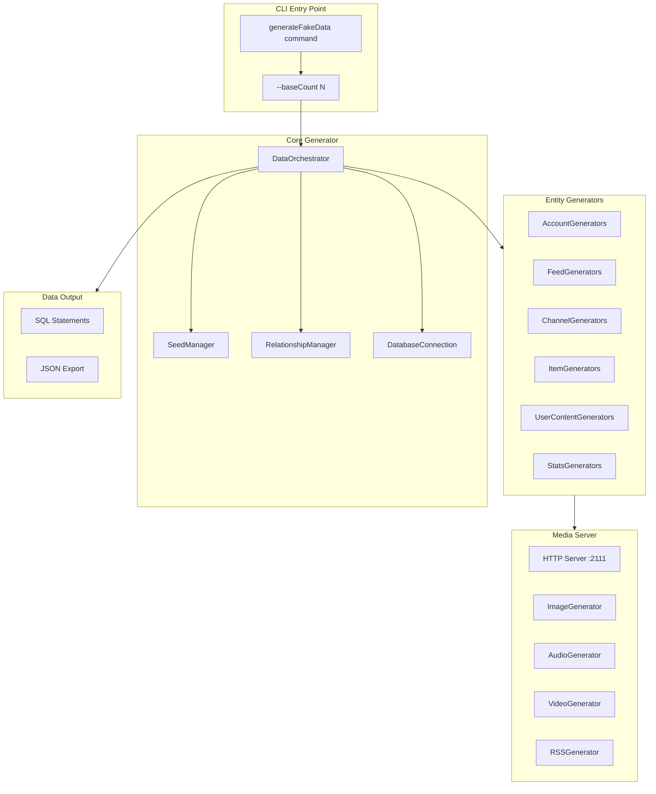

# Fake Data Generator - Architecture

## Overview

The fake data generator is a modular system that creates valid test data for all Podverse database tables. It uses `@faker-js/faker` for generating realistic fake data and serves demo media files via a local HTTP server.

## System Architecture



## Module Structure

### Directory Layout

```
podverse-qa/
├── src/
│   └── faker/
│       ├── index.ts              # Main exports
│       ├── constants.ts          # Special accounts & constants (existing)
│       ├── cli.ts                # CLI entry point and argument parsing
│       ├── config.ts             # Configuration management
│       ├── orchestrator.ts       # Main orchestration logic
│       │
│       ├── server/               # Media server components
│       │   ├── index.ts          # HTTP server setup
│       │   ├── imageGenerator.ts # Dynamic image generation
│       │   ├── audioGenerator.ts # Audio file generation
│       │   ├── videoGenerator.ts # Video file generation
│       │   └── rssGenerator.ts   # RSS feed generation
│       │
│       ├── generators/           # Entity generators
│       │   ├── index.ts          # Generator exports
│       │   ├── base.ts           # Base generator class
│       │   ├── account/          # Account-related generators
│       │   │   ├── index.ts
│       │   │   ├── account.ts
│       │   │   ├── accountCredentials.ts
│       │   │   ├── accountProfile.ts
│       │   │   ├── accountSettings.ts
│       │   │   ├── accountMembership.ts
│       │   │   ├── accountFollowing.ts
│       │   │   ├── accountDevices.ts
│       │   │   ├── accountNotifications.ts
│       │   │   └── accountPurchases.ts
│       │   ├── feed/             # Feed generators
│       │   │   ├── index.ts
│       │   │   ├── feed.ts
│       │   │   └── feedLog.ts
│       │   ├── channel/          # Channel generators
│       │   │   ├── index.ts
│       │   │   ├── channel.ts
│       │   │   ├── channelAbout.ts
│       │   │   ├── channelDescription.ts
│       │   │   ├── channelCategory.ts
│       │   │   ├── channelImage.ts
│       │   │   ├── channelPerson.ts
│       │   │   ├── channelFunding.ts
│       │   │   ├── channelValue.ts
│       │   │   ├── channelSeason.ts
│       │   │   └── ... (other channel entities)
│       │   ├── item/             # Item generators
│       │   │   ├── index.ts
│       │   │   ├── item.ts
│       │   │   ├── itemAbout.ts
│       │   │   ├── itemDescription.ts
│       │   │   ├── itemEnclosure.ts
│       │   │   ├── itemImage.ts
│       │   │   ├── itemPerson.ts
│       │   │   ├── itemChapter.ts
│       │   │   ├── itemValue.ts
│       │   │   ├── liveItem.ts
│       │   │   └── ... (other item entities)
│       │   ├── userContent/      # User-generated content
│       │   │   ├── index.ts
│       │   │   ├── clip.ts
│       │   │   ├── playlist.ts
│       │   │   └── queue.ts
│       │   └── stats/            # Statistics generators
│       │       ├── index.ts
│       │       ├── statsAggregated.ts
│       │       └── statsTrackEvent.ts
│       │
│       └── utils/                # Utility functions
│           ├── index.ts
│           ├── relationships.ts  # Relationship management
│           ├── validation.ts     # Data validation
│           ├── idGenerator.ts    # ID generation (nanoid compatible)
│           └── dateHelpers.ts    # Date generation utilities
```

## Core Components

### 1. CLI Entry Point (`cli.ts`)

The CLI provides the main interface for running the fake data generator.

```typescript
interface CLIOptions {
  baseCount: number;        // Required: base number of rows to generate
  seed?: number;            // Optional: random seed for reproducibility
  output?: 'sql' | 'json';  // Optional: output format (default: sql)
  dryRun?: boolean;         // Optional: generate without inserting
  startServer?: boolean;    // Optional: start media server (default: true)
  serverPort?: number;      // Optional: media server port (default: 2111)
}
```

**Usage:**
```bash
# Generate 100 base rows
npm run faker -- --baseCount 100

# Generate with specific seed for reproducibility
npm run faker -- --baseCount 100 --seed 12345

# Dry run (output SQL without executing)
npm run faker -- --baseCount 100 --dryRun

# Custom server port
npm run faker -- --baseCount 100 --serverPort 3000
```

### 2. Configuration (`config.ts`)

Centralized configuration management:

```typescript
export interface FakerConfig {
  // Base counts
  baseCount: number;
  
  // Relationship multipliers
  itemsPerChannel: number;      // Default: 2
  imagesPerEntity: number;      // Default: 2
  personsPerEntity: number;     // Default: 2
  categoriesPerChannel: number; // Default: 2
  enclosuresPerItem: number;    // Default: 2
  
  // Media server
  mediaServerPort: number;      // Default: 2111
  mediaServerHost: string;      // Default: 'localhost'
  
  // Special accounts
  specialAccounts: SpecialAccount[];
  
  // Database constants (from podverse-helpers)
  databaseConstants: typeof DATABASE_CONSTANTS;
}
```

### 3. Data Orchestrator (`orchestrator.ts`)

The orchestrator manages the generation process:

```typescript
class DataOrchestrator {
  constructor(config: FakerConfig);
  
  // Main generation method
  async generate(): Promise<GenerationResult>;
  
  // Generation phases (in order)
  private async generateAccounts(): Promise<Account[]>;
  private async generateFeeds(): Promise<Feed[]>;
  private async generateChannels(feeds: Feed[]): Promise<Channel[]>;
  private async generateItems(channels: Channel[]): Promise<Item[]>;
  private async generateUserContent(accounts: Account[], items: Item[]): Promise<void>;
  private async generateStats(channels: Channel[], items: Item[]): Promise<void>;
  
  // Utility methods
  private async startMediaServer(): Promise<void>;
  private async stopMediaServer(): Promise<void>;
}
```

### 4. Seed Manager

Ensures reproducible data generation:

```typescript
class SeedManager {
  private seed: number;
  private faker: Faker;
  
  constructor(seed?: number);
  
  // Get seeded faker instance
  getFaker(): Faker;
  
  // Reset to initial seed state
  reset(): void;
  
  // Get deterministic ID for entity
  getEntityId(entityType: string, index: number): string;
}
```

### 5. Relationship Manager

Tracks relationships between generated entities:

```typescript
class RelationshipManager {
  // Store generated entities
  private entities: Map<string, Map<number, any>>;
  
  // Register a generated entity
  register(type: string, id: number, entity: any): void;
  
  // Get entity by type and id
  get<T>(type: string, id: number): T | undefined;
  
  // Get all entities of a type
  getAll<T>(type: string): T[];
  
  // Get random entity of a type
  getRandom<T>(type: string): T;
  
  // Get random N entities of a type
  getRandomN<T>(type: string, count: number): T[];
}
```

## Data Flow

### Generation Order

The data must be generated in a specific order to satisfy foreign key constraints:

```
1. Lookup Tables (pre-existing, not generated)
   └── SharableStatus, Medium, Category, etc.

2. Accounts
   ├── Account (core)
   ├── AccountCredentials
   ├── AccountProfile
   ├── AccountSettings
   │   ├── AccountSettingsLocale
   │   └── AccountSettingsNotification
   │       └── AccountSettingsNotificationType
   ├── AccountMembershipStatus
   ├── AccountVerification
   └── (remaining account entities)

3. Feeds
   ├── Feed
   └── FeedLog

4. Channels (linked to Feeds)
   ├── Channel
   ├── ChannelAbout
   ├── ChannelDescription
   ├── ChannelCategory (2 per channel)
   ├── ChannelImage (2 per channel)
   ├── ChannelPerson (2 per channel)
   ├── ChannelFunding
   ├── ChannelValue
   │   └── ChannelValueRecipient
   └── (remaining channel entities)

5. Items (linked to Channels)
   ├── Item (2 per channel)
   ├── ItemAbout
   ├── ItemDescription
   ├── ItemEnclosure (2 per item)
   │   ├── ItemEnclosureIntegrity
   │   └── ItemEnclosureSource
   ├── ItemImage (2 per item)
   ├── ItemPerson (2 per item)
   ├── ItemChapter
   ├── ItemChaptersFeed
   ├── ItemValue
   │   ├── ItemValueRecipient
   │   └── ItemValueTimeSplit
   │       ├── ItemValueTimeSplitRecipient
   │       └── ItemValueTimeSplitRemoteItem
   └── (remaining item entities)

6. Live Items (linked to Items)
   └── LiveItem

7. User Content (linked to Accounts + Items)
   ├── Clip
   ├── Playlist
   │   └── PlaylistResource
   ├── Queue
   │   └── QueueResource
   ├── AccountFollowingChannel
   ├── AccountFollowingPlaylist
   └── AccountNotificationChannel
       └── AccountNotificationChannelType

8. Statistics
   ├── StatsAggregatedAccount
   ├── StatsAggregatedChannel
   ├── StatsAggregatedItem
   ├── StatsAggregatedClip
   ├── StatsAggregatedPlaylist
   ├── StatsTrackAccountGuid
   └── StatsTrackEvent* tables

9. Miscellaneous
   ├── MembershipClaimToken
   └── OnDemandParserEvent
```

## Dependencies

### Required NPM Packages

```json
{
  "dependencies": {
    "@faker-js/faker": "^10.0.0",        // Already installed
    "podverse-orm": "^5.0.5",            // Already installed
    "podverse-helpers": "^5.1.0",        // Already installed
    "sharp": "^0.33.0",                  // For image generation
    "commander": "^12.0.0"               // CLI argument parsing
  },
  "devDependencies": {
    "@types/node": "^24.4.0"             // Already installed
  }
}
```

### External Dependencies

- **Node.js built-in `http`**: For the media server
- **Node.js built-in `crypto`**: For generating unique IDs
- **podverse-orm entities**: For TypeORM entity definitions
- **podverse-helpers**: For DATABASE_CONSTANTS, enums, and utilities

## Base Count Calculations

Given `baseCount = N`:

| Entity Type | Count Formula | Example (N=100) |
|-------------|---------------|-----------------|
| Special Accounts | 4 | 4 |
| Random Accounts | N | 100 |
| **Total Accounts** | **4 + N** | **104** |
| Feeds | N | 100 |
| Channels | N | 100 |
| Items | N × 2 | 200 |
| Channel Images | N × 2 | 200 |
| Channel Persons | N × 2 | 200 |
| Channel Categories | N × 2 | 200 |
| Item Enclosures | N × 2 × 2 | 400 |
| Item Images | N × 2 × 2 | 400 |
| Item Persons | N × 2 × 2 | 400 |
| Clips | N | 100 |
| Playlists | N | 100 |
| Queues | 4 + N | 104 |
| Live Items | N × 0.1 (10%) | 10 |

## Error Handling

The generator implements comprehensive error handling:

```typescript
class GenerationError extends Error {
  constructor(
    message: string,
    public entityType: string,
    public entityIndex: number,
    public cause?: Error
  ) {
    super(message);
  }
}

// Usage in orchestrator
try {
  await this.generateChannel(feed, index);
} catch (error) {
  throw new GenerationError(
    `Failed to generate channel for feed ${feed.id}`,
    'Channel',
    index,
    error as Error
  );
}
```

## Testing Strategy

1. **Unit Tests**: Test individual generators in isolation
2. **Integration Tests**: Test the full generation pipeline
3. **Validation Tests**: Verify generated data matches entity constraints
4. **Relationship Tests**: Verify foreign key relationships are valid

## Performance Considerations

- Use batch inserts for better database performance
- Generate media files on-demand (lazy generation)
- Use streaming for large data exports
- Implement progress reporting for long-running generations

## Next Steps

See the following documentation files for detailed implementation:
- [02-media-server.md](./02-media-server.md) - Media server implementation
- [03-lookup-tables.md](./03-lookup-tables.md) - Lookup table reference
- [04-account-generators.md](./04-account-generators.md) - Account generation
- [05-feed-channel-generators.md](./05-feed-channel-generators.md) - Feed/Channel generation
- [06-item-generators.md](./06-item-generators.md) - Item generation
- [07-user-content-stats-generators.md](./07-user-content-stats-generators.md) - UGC and stats
- [08-llm-skills.md](./08-llm-skills.md) - LLM integration skills
