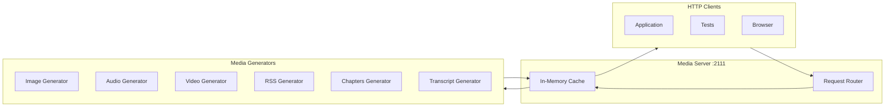

# Fake Data Generator - Media Server Core

## Overview

The media server is a lightweight HTTP server running on `localhost:2111` that serves dynamically generated demo media files. Files are generated on-demand when requested, ensuring minimal disk usage while providing valid media content for testing.

## Server Architecture



## URL Routing

### Endpoint Structure

| Path Pattern | Content-Type | Description |
|--------------|--------------|-------------|
| `/images/{id}.png` | `image/png` | Generated PNG images |
| `/images/{id}.jpg` | `image/jpeg` | Generated JPEG images |
| `/audio/{id}.mp3` | `audio/mpeg` | Generated MP3 audio files |
| `/audio/{id}.ogg` | `audio/ogg` | Generated OGG audio files |
| `/audio/{id}.wav` | `audio/wav` | Generated WAV audio files |
| `/video/{id}.mp4` | `video/mp4` | Generated MP4 video files |
| `/video/{id}.webm` | `video/webm` | Generated WebM video files |
| `/rss/{feedId}.xml` | `application/rss+xml` | Generated RSS feeds |
| `/chapters/{itemId}.json` | `application/json` | Podcast chapters JSON |
| `/transcripts/{itemId}.vtt` | `text/vtt` | WebVTT transcript files |
| `/transcripts/{itemId}.srt` | `text/srt` | SRT transcript files |

### Base URL Configuration

```typescript
const MEDIA_SERVER_BASE_URL = 'http://localhost:2111';

// URL builders for generators
export const buildImageUrl = (id: string, format: 'png' | 'jpg' = 'png') => 
  `${MEDIA_SERVER_BASE_URL}/images/${id}.${format}`;

export const buildAudioUrl = (id: string, format: 'mp3' | 'ogg' | 'wav' = 'mp3') => 
  `${MEDIA_SERVER_BASE_URL}/audio/${id}.${format}`;

export const buildVideoUrl = (id: string, format: 'mp4' | 'webm' = 'mp4') => 
  `${MEDIA_SERVER_BASE_URL}/video/${id}.${format}`;

export const buildRssUrl = (feedId: number) => 
  `${MEDIA_SERVER_BASE_URL}/rss/${feedId}.xml`;

export const buildChaptersUrl = (itemId: string) => 
  `${MEDIA_SERVER_BASE_URL}/chapters/${itemId}.json`;

export const buildTranscriptUrl = (itemId: string, format: 'vtt' | 'srt' = 'vtt') => 
  `${MEDIA_SERVER_BASE_URL}/transcripts/${itemId}.${format}`;
```

## Server Implementation

### Main Server (`server/index.ts`)

```typescript
import * as http from 'http';
import { imageGenerator } from './imageGenerator';
import { audioGenerator } from './audioGenerator';
import { videoGenerator } from './videoGenerator';
import { rssGenerator } from './rssGenerator';
import { chaptersGenerator } from './chaptersGenerator';
import { transcriptGenerator } from './transcriptGenerator';

interface MediaServerConfig {
  port: number;
  host: string;
}

class MediaServer {
  private server: http.Server | null = null;
  private cache: Map<string, { data: Buffer; contentType: string }> = new Map();
  
  constructor(private config: MediaServerConfig) {}
  
  async start(): Promise<void> {
    return new Promise((resolve, reject) => {
      this.server = http.createServer(async (req, res) => {
        try {
          await this.handleRequest(req, res);
        } catch (error) {
          console.error('Request error:', error);
          res.writeHead(500, { 'Content-Type': 'text/plain' });
          res.end('Internal Server Error');
        }
      });
      
      this.server.listen(this.config.port, this.config.host, () => {
        console.log(`Media server running at http://${this.config.host}:${this.config.port}`);
        resolve();
      });
      
      this.server.on('error', reject);
    });
  }
  
  async stop(): Promise<void> {
    return new Promise((resolve) => {
      if (this.server) {
        this.server.close(() => resolve());
      } else {
        resolve();
      }
    });
  }
  
  private async handleRequest(
    req: http.IncomingMessage,
    res: http.ServerResponse
  ): Promise<void> {
    const url = new URL(req.url || '/', `http://${req.headers.host}`);
    const path = url.pathname;
    
    // Check cache first
    const cached = this.cache.get(path);
    if (cached) {
      res.writeHead(200, { 'Content-Type': cached.contentType });
      res.end(cached.data);
      return;
    }
    
    // Route to appropriate generator
    let result: { data: Buffer; contentType: string } | null = null;
    
    if (path.startsWith('/images/')) {
      result = await imageGenerator.generate(path);
    } else if (path.startsWith('/audio/')) {
      result = await audioGenerator.generate(path);
    } else if (path.startsWith('/video/')) {
      result = await videoGenerator.generate(path);
    } else if (path.startsWith('/rss/')) {
      result = await rssGenerator.generate(path);
    } else if (path.startsWith('/chapters/')) {
      result = await chaptersGenerator.generate(path);
    } else if (path.startsWith('/transcripts/')) {
      result = await transcriptGenerator.generate(path);
    }
    
    if (result) {
      // Cache the result
      this.cache.set(path, result);
      
      res.writeHead(200, { 'Content-Type': result.contentType });
      res.end(result.data);
    } else {
      res.writeHead(404, { 'Content-Type': 'text/plain' });
      res.end('Not Found');
    }
  }
  
  clearCache(): void {
    this.cache.clear();
  }
}

export const createMediaServer = (config?: Partial<MediaServerConfig>) => {
  return new MediaServer({
    port: config?.port || 2111,
    host: config?.host || 'localhost'
  });
};
```

## Usage Example

```typescript
import { createMediaServer } from './server';

async function main() {
  const server = createMediaServer({ port: 2111 });
  
  await server.start();
  console.log('Media server running on http://localhost:2111');
  
  // Server will now respond to requests like:
  // - http://localhost:2111/images/abc123.png
  // - http://localhost:2111/audio/episode-1.mp3
  // - http://localhost:2111/video/intro.mp4
  // - http://localhost:2111/rss/1.xml
  // - http://localhost:2111/chapters/ep1.json
  // - http://localhost:2111/transcripts/ep1.vtt
  
  // Stop server when done
  // await server.stop();
}

main().catch(console.error);
```

## Testing

```bash
# Start server
npm run faker:server

# Test endpoints
curl http://localhost:2111/images/test.png > test.png
curl http://localhost:2111/audio/test.mp3 > test.mp3
curl http://localhost:2111/rss/1.xml
curl http://localhost:2111/chapters/item1.json
curl http://localhost:2111/transcripts/item1.vtt
```

## Dependencies

- Node.js built-in `http` module
- Individual generator modules (see separate docs)
