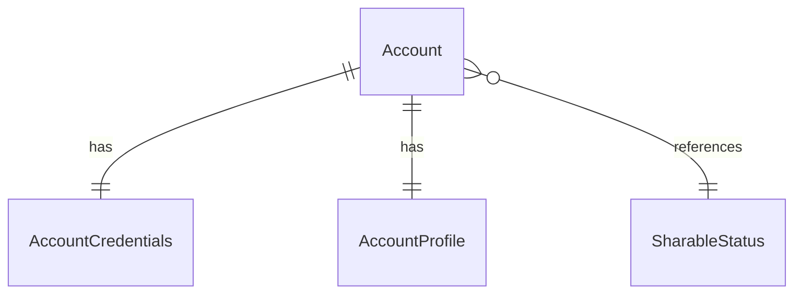

# Fake Data Generator - Account Core

## Overview

Account core generators create the fundamental account entities: `Account`, `AccountCredentials`, and `AccountProfile`. These are the foundation for all user-related data.

## Special Accounts

From `src/faker/constants.ts`:

```typescript
export const FAKER = {
  ACCOUNTS: [
    { email: 'basic-valid@example.com', password: 'Test!1Aa' },
    { email: 'trial-valid@example.com', password: 'Test!1Aa' },
    { email: 'trial-expired@example.com', password: 'Test!1Aa' },
    { email: 'basic-expired@example.com', password: 'Test!1Aa' }
  ]
};
```

### Special Account Configuration

| Email | Membership | Status | Description |
|-------|------------|--------|-------------|
| basic-valid@example.com | Basic | Valid (future expiry) | Active premium user |
| trial-valid@example.com | Trial | Valid (future expiry) | Active trial user |
| trial-expired@example.com | Trial | Expired | User with expired trial |
| basic-expired@example.com | Basic | Expired | User with expired premium |

## Entity Relationships



## Base Account Generator

```typescript
// src/faker/generators/account/account.ts

import { faker } from '@faker-js/faker';
import { generateRandomIdText } from 'podverse-orm';
import { SharableStatusEnum } from 'podverse-helpers';
import { FAKER } from '../../constants';

export interface GeneratedAccount {
  id: number;
  id_text: string;
  verified: boolean;
  sharable_status_id: number;
  isSpecial: boolean;
  specialConfig?: {
    email: string;
    password: string;
    membershipType: 'trial' | 'basic';
    isExpired: boolean;
  };
}

export class AccountGenerator {
  private accountIdCounter = 1;
  
  generateSpecialAccounts(): GeneratedAccount[] {
    return FAKER.ACCOUNTS.map((specialAccount, index) => {
      const membershipType = specialAccount.email.includes('basic') ? 'basic' : 'trial';
      const isExpired = specialAccount.email.includes('expired');
      
      return {
        id: this.accountIdCounter++,
        id_text: generateRandomIdText(),
        verified: true, // Special accounts are always verified
        sharable_status_id: SharableStatusEnum.Public,
        isSpecial: true,
        specialConfig: {
          email: specialAccount.email,
          password: specialAccount.password,
          membershipType,
          isExpired
        }
      };
    });
  }
  
  generateRandomAccount(): GeneratedAccount {
    return {
      id: this.accountIdCounter++,
      id_text: generateRandomIdText(),
      verified: faker.datatype.boolean({ probability: 0.8 }), // 80% verified
      sharable_status_id: faker.helpers.weightedArrayElement([
        { value: SharableStatusEnum.Public, weight: 7 },
        { value: SharableStatusEnum.Unlisted, weight: 2 },
        { value: SharableStatusEnum.Private, weight: 1 }
      ]),
      isSpecial: false
    };
  }
  
  generateRandomAccounts(count: number): GeneratedAccount[] {
    return Array.from({ length: count }, () => this.generateRandomAccount());
  }
  
  // SQL output
  toSQL(account: GeneratedAccount): string {
    return `INSERT INTO account (id, id_text, verified, sharable_status_id) VALUES (${account.id}, '${account.id_text}', ${account.verified}, ${account.sharable_status_id});`;
  }
}
```

## Account Credentials Generator

```typescript
// src/faker/generators/account/accountCredentials.ts

import { faker } from '@faker-js/faker';
import { DATABASE_CONSTANTS } from 'podverse-helpers';
import { hashPassword } from 'podverse-orm';
import { GeneratedAccount } from './account';

export interface GeneratedAccountCredentials {
  id: number;
  account_id: number;
  email: string;
  password: string; // hashed
}

export class AccountCredentialsGenerator {
  private idCounter = 1;
  
  async generate(account: GeneratedAccount): Promise<GeneratedAccountCredentials> {
    let email: string;
    let plainPassword: string;
    
    if (account.isSpecial && account.specialConfig) {
      email = account.specialConfig.email;
      plainPassword = account.specialConfig.password;
    } else {
      email = faker.internet.email().toLowerCase().slice(0, DATABASE_CONSTANTS.varchar_email);
      plainPassword = this.generateValidPassword();
    }
    
    const hashedPassword = await hashPassword(plainPassword);
    
    return {
      id: this.idCounter++,
      account_id: account.id,
      email,
      password: hashedPassword
    };
  }
  
  private generateValidPassword(): string {
    // Must satisfy: min 8 chars, at least one non-lowercase character
    const basePassword = faker.internet.password({ length: 10, memorable: false });
    // Ensure it has uppercase
    return basePassword.charAt(0).toUpperCase() + basePassword.slice(1) + '1!';
  }
  
  toSQL(creds: GeneratedAccountCredentials): string {
    return `INSERT INTO account_credentials (id, account_id, email, password) VALUES (${creds.id}, ${creds.account_id}, '${creds.email}', '${creds.password}');`;
  }
}
```

## Account Profile Generator

```typescript
// src/faker/generators/account/accountProfile.ts

import { faker } from '@faker-js/faker';
import { DATABASE_CONSTANTS } from 'podverse-helpers';
import { GeneratedAccount } from './account';

export interface GeneratedAccountProfile {
  id: number;
  account_id: number;
  name: string | null;
  bio: string | null;
  website_url: string | null;
  image_url: string | null;
}

export class AccountProfileGenerator {
  private idCounter = 1;
  private mediaServerBase = 'http://localhost:2111';
  
  generate(account: GeneratedAccount): GeneratedAccountProfile {
    const hasProfile = faker.datatype.boolean({ probability: 0.7 });
    
    return {
      id: this.idCounter++,
      account_id: account.id,
      name: hasProfile 
        ? faker.person.fullName().slice(0, DATABASE_CONSTANTS.varchar_normal) 
        : null,
      bio: hasProfile && faker.datatype.boolean({ probability: 0.5 })
        ? faker.lorem.paragraph().slice(0, DATABASE_CONSTANTS.varchar_long)
        : null,
      website_url: hasProfile && faker.datatype.boolean({ probability: 0.3 })
        ? faker.internet.url().slice(0, DATABASE_CONSTANTS.varchar_url)
        : null,
      image_url: hasProfile && faker.datatype.boolean({ probability: 0.6 })
        ? `${this.mediaServerBase}/images/profile-${account.id_text}.png`
        : null
    };
  }
  
  toSQL(profile: GeneratedAccountProfile): string {
    const name = profile.name ? `'${this.escapeSQL(profile.name)}'` : 'NULL';
    const bio = profile.bio ? `'${this.escapeSQL(profile.bio)}'` : 'NULL';
    const websiteUrl = profile.website_url ? `'${profile.website_url}'` : 'NULL';
    const imageUrl = profile.image_url ? `'${profile.image_url}'` : 'NULL';
    
    return `INSERT INTO account_profile (id, account_id, name, bio, website_url, image_url) VALUES (${profile.id}, ${profile.account_id}, ${name}, ${bio}, ${websiteUrl}, ${imageUrl});`;
  }
  
  private escapeSQL(str: string): string {
    return str.replace(/'/g, "''");
  }
}
```

## Summary

| Entity | Count for baseCount=100 |
|--------|------------------------|
| Account | 4 special + 100 random = 104 |
| AccountCredentials | 104 (1 per account) |
| AccountProfile | 104 (1 per account) |
