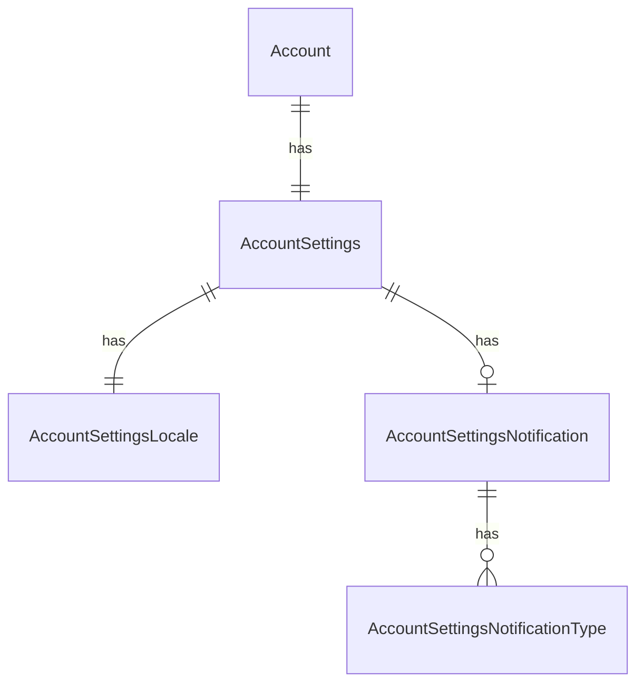

# Fake Data Generator - Account Settings

## Overview

Account settings generators create user preferences including locale settings and notification configurations.

## Entity Relationships



## Account Settings Generator

```typescript
// src/faker/generators/account/accountSettings.ts

import { faker } from '@faker-js/faker';
import { GeneratedAccount } from './account';

export interface GeneratedAccountSettings {
  id: number;
  account_id: number;
  autoplay_enabled: boolean;
  continuous_playback_enabled: boolean;
  playback_speed: string;
  volume: number;
}

export interface GeneratedAccountSettingsLocale {
  id: number;
  account_settings_id: number;
  locale: string;
  timezone: string | null;
}

export interface GeneratedAccountSettingsNotification {
  id: number;
  account_settings_id: number;
  push_enabled: boolean;
  email_enabled: boolean;
}

export interface GeneratedAccountSettingsNotificationType {
  id: number;
  account_settings_notification_id: number;
  type: string; // AccountNotificationTypeEnum value
}

export class AccountSettingsGenerator {
  private settingsIdCounter = 1;
  private localeIdCounter = 1;
  private notificationIdCounter = 1;
  private notificationTypeIdCounter = 1;
  
  private playbackSpeeds = ['0.5', '0.75', '1', '1.25', '1.5', '1.75', '2'];
  private locales = ['en', 'en-US', 'en-GB', 'es', 'es-MX', 'de', 'fr', 'pt-BR', 'ja', 'zh'];
  private timezones = [
    'America/New_York', 'America/Los_Angeles', 'America/Chicago',
    'Europe/London', 'Europe/Paris', 'Europe/Berlin',
    'Asia/Tokyo', 'Asia/Shanghai', 'Australia/Sydney'
  ];
  
  generate(account: GeneratedAccount): {
    settings: GeneratedAccountSettings;
    locale: GeneratedAccountSettingsLocale;
    notification: GeneratedAccountSettingsNotification;
    notificationTypes: GeneratedAccountSettingsNotificationType[];
  } {
    const settingsId = this.settingsIdCounter++;
    const notificationId = this.notificationIdCounter++;
    
    const settings: GeneratedAccountSettings = {
      id: settingsId,
      account_id: account.id,
      autoplay_enabled: faker.datatype.boolean({ probability: 0.6 }),
      continuous_playback_enabled: faker.datatype.boolean({ probability: 0.7 }),
      playback_speed: faker.helpers.arrayElement(this.playbackSpeeds),
      volume: faker.number.int({ min: 0, max: 100 })
    };
    
    const locale: GeneratedAccountSettingsLocale = {
      id: this.localeIdCounter++,
      account_settings_id: settingsId,
      locale: faker.helpers.arrayElement(this.locales),
      timezone: faker.datatype.boolean({ probability: 0.7 })
        ? faker.helpers.arrayElement(this.timezones)
        : null
    };
    
    const notification: GeneratedAccountSettingsNotification = {
      id: notificationId,
      account_settings_id: settingsId,
      push_enabled: faker.datatype.boolean({ probability: 0.5 }),
      email_enabled: faker.datatype.boolean({ probability: 0.3 })
    };
    
    // Generate notification types
    const notificationTypes: GeneratedAccountSettingsNotificationType[] = [];
    const types = ['new-item', 'livestream-scheduled', 'livestream-started'];
    
    // Randomly enable some notification types
    for (const type of types) {
      if (faker.datatype.boolean({ probability: 0.6 })) {
        notificationTypes.push({
          id: this.notificationTypeIdCounter++,
          account_settings_notification_id: notificationId,
          type
        });
      }
    }
    
    return { settings, locale, notification, notificationTypes };
  }
}
```

## Summary

| Entity | Count for baseCount=100 |
|--------|------------------------|
| AccountSettings | 104 (1 per account) |
| AccountSettingsLocale | 104 (1 per settings) |
| AccountSettingsNotification | 104 (1 per settings) |
| AccountSettingsNotificationType | ~180 (1-3 per notification) |
