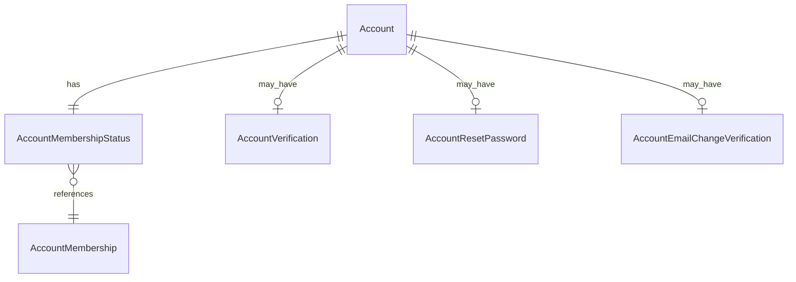

# Fake Data Generator - Account Membership

## Overview

Account membership generators create membership status and verification data for accounts.

## Entity Relationships



## Account Membership Status Generator

```typescript
// src/faker/generators/account/accountMembership.ts

import { faker } from '@faker-js/faker';
import { AccountMembershipEnum } from 'podverse-helpers';
import { GeneratedAccount } from './account';

export interface GeneratedAccountMembershipStatus {
  id: number;
  account_id: number;
  account_membership_id: number;
  membership_expires_at: Date | null;
  auto_renew: boolean;
}

export class AccountMembershipStatusGenerator {
  private idCounter = 1;
  
  generate(account: GeneratedAccount): GeneratedAccountMembershipStatus {
    let membershipId: number;
    let expiresAt: Date | null;
    let autoRenew: boolean;
    
    if (account.isSpecial && account.specialConfig) {
      // Special account configuration
      membershipId = account.specialConfig.membershipType === 'basic'
        ? AccountMembershipEnum.Basic
        : AccountMembershipEnum.Trial;
      
      if (account.specialConfig.isExpired) {
        // Expired membership
        expiresAt = faker.date.past({ years: 1 });
        autoRenew = false;
      } else {
        // Valid membership
        expiresAt = faker.date.future({ years: 1 });
        autoRenew = account.specialConfig.membershipType === 'basic';
      }
    } else {
      // Random account
      membershipId = faker.helpers.weightedArrayElement([
        { value: AccountMembershipEnum.Trial, weight: 7 },
        { value: AccountMembershipEnum.Basic, weight: 3 }
      ]);
      
      // 80% have future expiry, 20% expired
      const isActive = faker.datatype.boolean({ probability: 0.8 });
      expiresAt = isActive
        ? faker.date.future({ years: 1 })
        : faker.date.past({ years: 1 });
      
      autoRenew = isActive && membershipId === AccountMembershipEnum.Basic
        ? faker.datatype.boolean({ probability: 0.7 })
        : false;
    }
    
    return {
      id: this.idCounter++,
      account_id: account.id,
      account_membership_id: membershipId,
      membership_expires_at: expiresAt,
      auto_renew: autoRenew
    };
  }
}
```

## Account Verification Generator

```typescript
// src/faker/generators/account/accountVerification.ts

import { faker } from '@faker-js/faker';
import { GeneratedAccount } from './account';

export interface GeneratedAccountVerification {
  id: number;
  account_id: number;
  verification_token: string;
  created_at: Date;
  verified_at: Date | null;
}

export class AccountVerificationGenerator {
  private idCounter = 1;
  
  generate(account: GeneratedAccount): GeneratedAccountVerification | null {
    // Only generate verification for verified accounts
    if (!account.verified) {
      return null;
    }
    
    const createdAt = faker.date.past({ years: 2 });
    const verifiedAt = new Date(createdAt);
    verifiedAt.setHours(verifiedAt.getHours() + faker.number.int({ min: 1, max: 48 }));
    
    return {
      id: this.idCounter++,
      account_id: account.id,
      verification_token: faker.string.uuid(),
      created_at: createdAt,
      verified_at: verifiedAt
    };
  }
}
```

## Summary

| Entity | Count for baseCount=100 |
|--------|------------------------|
| AccountMembershipStatus | 104 (1 per account) |
| AccountVerification | ~83 (80% of accounts are verified) |
