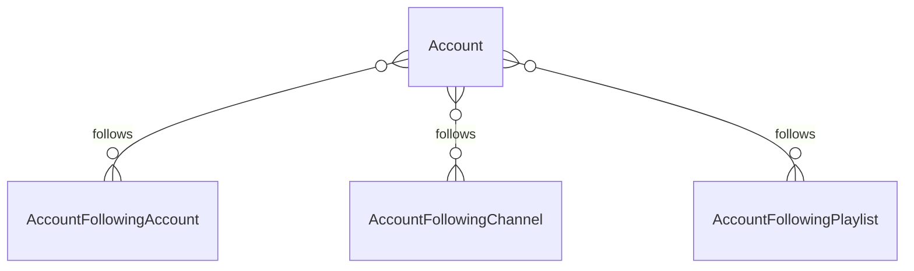

# Fake Data Generator - Account Following

## Overview

Account following generators create relationships between accounts and various content types (channels, playlists, and other accounts).

> **⚠️ Excluded:** `AccountFollowingAddByRSSChannel` is **NOT** part of this initial implementation. Add-by-RSS data involves JSON columns with complex, open-ended data structures and will be implemented separately after all other faker work is complete. See [00-index.md](./00-index.md#excluded-features-deferred) for details.

## Entity Relationships



## Account Following Generators

```typescript
// src/faker/generators/account/accountFollowing.ts

import { faker } from '@faker-js/faker';
import { GeneratedAccount } from './account';

export interface GeneratedAccountFollowingChannel {
  id: number;
  account_id: number;
  channel_id: number;
  added_at: Date;
}

export interface GeneratedAccountFollowingPlaylist {
  id: number;
  account_id: number;
  playlist_id: number;
  added_at: Date;
}

export interface GeneratedAccountFollowingAccount {
  id: number;
  account_id: number;
  following_account_id: number;
  added_at: Date;
}

// NOTE: AccountFollowingAddByRSSChannel is EXCLUDED from initial implementation
// It will be added in a separate phase after core faker work is complete

export class AccountFollowingGenerator {
  private channelIdCounter = 1;
  private playlistIdCounter = 1;
  private accountIdCounter = 1;
  
  generateChannelFollowing(
    account: GeneratedAccount,
    channelIds: number[]
  ): GeneratedAccountFollowingChannel[] {
    // Each account follows 2-10 random channels
    const followCount = Math.min(
      faker.number.int({ min: 2, max: 10 }),
      channelIds.length
    );
    
    const selectedChannels = faker.helpers.arrayElements(channelIds, followCount);
    
    return selectedChannels.map(channelId => ({
      id: this.channelIdCounter++,
      account_id: account.id,
      channel_id: channelId,
      added_at: faker.date.past({ years: 2 })
    }));
  }
  
  generatePlaylistFollowing(
    account: GeneratedAccount,
    playlistIds: number[]
  ): GeneratedAccountFollowingPlaylist[] {
    // Each account follows 0-5 playlists
    const followCount = Math.min(
      faker.number.int({ min: 0, max: 5 }),
      playlistIds.length
    );
    
    if (followCount === 0) return [];
    
    const selectedPlaylists = faker.helpers.arrayElements(playlistIds, followCount);
    
    return selectedPlaylists.map(playlistId => ({
      id: this.playlistIdCounter++,
      account_id: account.id,
      playlist_id: playlistId,
      added_at: faker.date.past({ years: 1 })
    }));
  }
  
  generateAccountFollowing(
    account: GeneratedAccount,
    otherAccountIds: number[]
  ): GeneratedAccountFollowingAccount[] {
    // Filter out self-following
    const validAccountIds = otherAccountIds.filter(id => id !== account.id);
    
    // Each account follows 0-5 other accounts
    const followCount = Math.min(
      faker.number.int({ min: 0, max: 5 }),
      validAccountIds.length
    );
    
    if (followCount === 0) return [];
    
    const selectedAccounts = faker.helpers.arrayElements(validAccountIds, followCount);
    
    return selectedAccounts.map(followingId => ({
      id: this.accountIdCounter++,
      account_id: account.id,
      following_account_id: followingId,
      added_at: faker.date.past({ years: 1 })
    }));
  }
  
  // NOTE: generateAddByRSSFollowing() is EXCLUDED from initial implementation
  // AccountFollowingAddByRSSChannel will be added in a separate phase
}
```

## Summary

| Entity | Count for baseCount=100 |
|--------|------------------------|
| AccountFollowingChannel | ~624 (2-10 per account) |
| AccountFollowingPlaylist | ~260 (0-5 per account) |
| AccountFollowingAccount | ~260 (0-5 per account) |

> **Excluded:** `AccountFollowingAddByRSSChannel` - deferred to separate implementation phase
