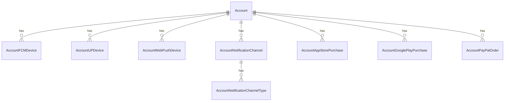

# Fake Data Generator - Account Devices & Purchases

## Overview

Account device generators create push notification device registrations. Purchase generators create payment/subscription records.

## Entity Relationships



## Account Device Generators

```typescript
// src/faker/generators/account/accountDevices.ts

import { faker } from '@faker-js/faker';
import { DATABASE_CONSTANTS } from 'podverse-helpers';
import { GeneratedAccount } from './account';

export interface GeneratedAccountFCMDevice {
  id: number;
  account_id: number;
  fcm_token: string;
  device_type: string;
  created_at: Date;
  updated_at: Date;
}

export interface GeneratedAccountUPDevice {
  id: number;
  account_id: number;
  endpoint: string;
  created_at: Date;
}

export interface GeneratedAccountWebPushDevice {
  id: number;
  account_id: number;
  endpoint: string;
  p256dh: string;
  auth: string;
  created_at: Date;
}

export class AccountDevicesGenerator {
  private fcmIdCounter = 1;
  private upIdCounter = 1;
  private webPushIdCounter = 1;
  
  generateFCMDevices(account: GeneratedAccount): GeneratedAccountFCMDevice[] {
    // 40% of accounts have FCM devices
    if (!faker.datatype.boolean({ probability: 0.4 })) return [];
    
    const count = faker.number.int({ min: 1, max: 3 });
    const createdAt = faker.date.past({ years: 1 });
    
    return Array.from({ length: count }, () => ({
      id: this.fcmIdCounter++,
      account_id: account.id,
      fcm_token: faker.string.alphanumeric(152).slice(0, DATABASE_CONSTANTS.varchar_fcm_token),
      device_type: faker.helpers.arrayElement(['ios', 'android']),
      created_at: createdAt,
      updated_at: faker.date.between({ from: createdAt, to: new Date() })
    }));
  }
  
  generateUPDevices(account: GeneratedAccount): GeneratedAccountUPDevice[] {
    // 10% of accounts have UP devices
    if (!faker.datatype.boolean({ probability: 0.1 })) return [];
    
    return [{
      id: this.upIdCounter++,
      account_id: account.id,
      endpoint: faker.internet.url() + '/up/push',
      created_at: faker.date.past({ years: 1 })
    }];
  }
  
  generateWebPushDevices(account: GeneratedAccount): GeneratedAccountWebPushDevice[] {
    // 30% of accounts have web push devices
    if (!faker.datatype.boolean({ probability: 0.3 })) return [];
    
    const count = faker.number.int({ min: 1, max: 2 });
    
    return Array.from({ length: count }, () => ({
      id: this.webPushIdCounter++,
      account_id: account.id,
      endpoint: `https://fcm.googleapis.com/fcm/send/${faker.string.alphanumeric(152)}`,
      p256dh: faker.string.alphanumeric(87),
      auth: faker.string.alphanumeric(22),
      created_at: faker.date.past({ years: 1 })
    }));
  }
}
```

## Account Notification Channel Generator

```typescript
// src/faker/generators/account/accountNotifications.ts

import { faker } from '@faker-js/faker';
import { AccountNotificationTypeEnum } from 'podverse-helpers';
import { GeneratedAccount } from './account';

export interface GeneratedAccountNotificationChannel {
  id: number;
  account_id: number;
  channel_id: number;
  created_at: Date;
}

export interface GeneratedAccountNotificationChannelType {
  id: number;
  account_notification_channel_id: number;
  type: string;
}

export class AccountNotificationChannelGenerator {
  private notificationIdCounter = 1;
  private typeIdCounter = 1;
  
  generate(
    account: GeneratedAccount,
    followedChannelIds: number[]
  ): {
    notifications: GeneratedAccountNotificationChannel[];
    types: GeneratedAccountNotificationChannelType[];
  } {
    const notifications: GeneratedAccountNotificationChannel[] = [];
    const types: GeneratedAccountNotificationChannelType[] = [];
    
    // Subscribe to notifications for 30% of followed channels
    const subscribedChannels = followedChannelIds.filter(
      () => faker.datatype.boolean({ probability: 0.3 })
    );
    
    for (const channelId of subscribedChannels) {
      const notificationId = this.notificationIdCounter++;
      
      notifications.push({
        id: notificationId,
        account_id: account.id,
        channel_id: channelId,
        created_at: faker.date.past({ years: 1 })
      });
      
      // Add notification types (at least one)
      const notificationTypes = this.getRandomNotificationTypes();
      for (const type of notificationTypes) {
        types.push({
          id: this.typeIdCounter++,
          account_notification_channel_id: notificationId,
          type
        });
      }
    }
    
    return { notifications, types };
  }
  
  private getRandomNotificationTypes(): string[] {
    const allTypes = [
      AccountNotificationTypeEnum.NewItem,
      AccountNotificationTypeEnum.LivestreamScheduled,
      AccountNotificationTypeEnum.LivestreamStarting
    ];
    
    // Always include at least one, potentially all
    const count = faker.number.int({ min: 1, max: 3 });
    return faker.helpers.arrayElements(allTypes, count);
  }
}
```

## Account Purchase Generators

```typescript
// src/faker/generators/account/accountPurchases.ts

import { faker } from '@faker-js/faker';
import { AccountMembershipEnum } from 'podverse-helpers';
import { GeneratedAccount } from './account';

export interface GeneratedAccountAppStorePurchase {
  id: number;
  account_id: number;
  transaction_id: string;
  original_transaction_id: string;
  product_id: string;
  purchase_date: Date;
  expires_date: Date | null;
}

export interface GeneratedAccountGooglePlayPurchase {
  id: number;
  account_id: number;
  order_id: string;
  purchase_token: string;
  product_id: string;
  purchase_time: Date;
  expiry_time: Date | null;
}

export interface GeneratedAccountPayPalOrder {
  id: number;
  account_id: number;
  order_id: string;
  capture_id: string | null;
  status: string;
  amount: string;
  currency: string;
  created_at: Date;
  updated_at: Date;
}

export class AccountPurchasesGenerator {
  private appStoreIdCounter = 1;
  private googlePlayIdCounter = 1;
  private payPalIdCounter = 1;
  
  generateAppStorePurchase(
    account: GeneratedAccount,
    membershipStatus: { account_membership_id: number; membership_expires_at: Date | null }
  ): GeneratedAccountAppStorePurchase | null {
    // Only for basic members, 30% chance
    if (membershipStatus.account_membership_id !== AccountMembershipEnum.Basic) return null;
    if (!faker.datatype.boolean({ probability: 0.3 })) return null;
    
    const purchaseDate = faker.date.past({ years: 1 });
    
    return {
      id: this.appStoreIdCounter++,
      account_id: account.id,
      transaction_id: faker.string.numeric(15),
      original_transaction_id: faker.string.numeric(15),
      product_id: 'com.podverse.premium.monthly',
      purchase_date: purchaseDate,
      expires_date: membershipStatus.membership_expires_at
    };
  }
  
  generateGooglePlayPurchase(
    account: GeneratedAccount,
    membershipStatus: { account_membership_id: number; membership_expires_at: Date | null }
  ): GeneratedAccountGooglePlayPurchase | null {
    // Only for basic members, 30% chance
    if (membershipStatus.account_membership_id !== AccountMembershipEnum.Basic) return null;
    if (!faker.datatype.boolean({ probability: 0.3 })) return null;
    
    return {
      id: this.googlePlayIdCounter++,
      account_id: account.id,
      order_id: `GPA.${faker.string.numeric(4)}-${faker.string.numeric(4)}-${faker.string.numeric(4)}-${faker.string.numeric(5)}`,
      purchase_token: faker.string.alphanumeric(164),
      product_id: 'premium_monthly',
      purchase_time: faker.date.past({ years: 1 }),
      expiry_time: membershipStatus.membership_expires_at
    };
  }
  
  generatePayPalOrder(
    account: GeneratedAccount,
    membershipStatus: { account_membership_id: number }
  ): GeneratedAccountPayPalOrder | null {
    // Only for basic members, 30% chance
    if (membershipStatus.account_membership_id !== AccountMembershipEnum.Basic) return null;
    if (!faker.datatype.boolean({ probability: 0.3 })) return null;
    
    const createdAt = faker.date.past({ years: 1 });
    
    return {
      id: this.payPalIdCounter++,
      account_id: account.id,
      order_id: faker.string.alphanumeric(17).toUpperCase(),
      capture_id: faker.string.alphanumeric(17).toUpperCase(),
      status: 'COMPLETED',
      amount: '9.99',
      currency: 'USD',
      created_at: createdAt,
      updated_at: createdAt
    };
  }
}
```

## Summary

| Entity | Count for baseCount=100 |
|--------|------------------------|
| AccountFCMDevice | ~124 (40% have 1-3) |
| AccountUPDevice | ~10 (10% have 1) |
| AccountWebPushDevice | ~47 (30% have 1-2) |
| AccountNotificationChannel | ~62 (30% of followed channels) |
| AccountNotificationChannelType | ~93 (1-3 per notification) |
| AccountAppStorePurchase | ~9 (30% of basic members) |
| AccountGooglePlayPurchase | ~9 (30% of basic members) |
| AccountPayPalOrder | ~9 (30% of basic members) |
