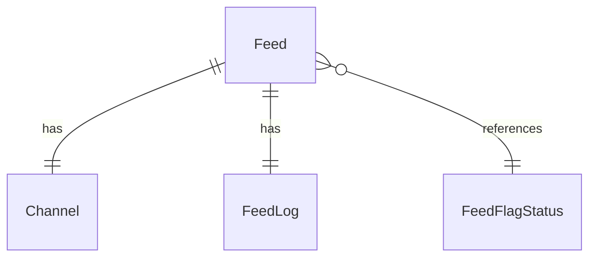

# Fake Data Generator - Feed Core

## Overview

Feed generators create the RSS feed records and their associated logs. Each Feed has exactly one Channel.

## Entity Relationships



## Feed Generator

```typescript
// src/faker/generators/feed/feed.ts

import { faker } from '@faker-js/faker';
import { DATABASE_CONSTANTS } from 'podverse-helpers';
import { FeedFlagStatusStatusEnum } from 'podverse-orm';

export interface GeneratedFeed {
  id: number;
  url: string;
  podcast_index_id: number;
  feed_flag_status_id: number;
  is_parsing: Date | null;
  parsing_priority: number;
  last_parsed_file_hash: string | null;
  container_id: string | null;
  created_at: Date;
  updated_at: Date;
}

export class FeedGenerator {
  private idCounter = 1;
  private podcastIndexIdCounter = 1000000;
  private mediaServerBase = 'http://localhost:2111';
  
  generate(): GeneratedFeed {
    const createdAt = faker.date.past({ years: 3 });
    const updatedAt = faker.date.between({ from: createdAt, to: new Date() });
    
    return {
      id: this.idCounter++,
      url: `${this.mediaServerBase}/rss/${this.idCounter - 1}.xml`,
      podcast_index_id: this.podcastIndexIdCounter++,
      feed_flag_status_id: faker.helpers.weightedArrayElement([
        { value: FeedFlagStatusStatusEnum.Active, weight: 9 },
        { value: FeedFlagStatusStatusEnum.AlwaysParse, weight: 1 }
      ]),
      is_parsing: null, // Not currently parsing
      parsing_priority: faker.number.int({ min: 0, max: 3 }),
      last_parsed_file_hash: faker.datatype.boolean({ probability: 0.9 })
        ? faker.string.alphanumeric(DATABASE_CONSTANTS.varchar_md5)
        : null,
      container_id: null,
      created_at: createdAt,
      updated_at: updatedAt
    };
  }
  
  generateMany(count: number): GeneratedFeed[] {
    return Array.from({ length: count }, () => this.generate());
  }
  
  toSQL(feed: GeneratedFeed): string {
    const isParsing = feed.is_parsing ? `'${feed.is_parsing.toISOString()}'` : 'NULL';
    const lastHash = feed.last_parsed_file_hash ? `'${feed.last_parsed_file_hash}'` : 'NULL';
    const containerId = feed.container_id ? `'${feed.container_id}'` : 'NULL';
    
    return `INSERT INTO feed (id, url, podcast_index_id, feed_flag_status_id, is_parsing, parsing_priority, last_parsed_file_hash, container_id, created_at, updated_at) VALUES (${feed.id}, '${feed.url}', ${feed.podcast_index_id}, ${feed.feed_flag_status_id}, ${isParsing}, ${feed.parsing_priority}, ${lastHash}, ${containerId}, '${feed.created_at.toISOString()}', '${feed.updated_at.toISOString()}');`;
  }
}
```

## Feed Log Generator

```typescript
// src/faker/generators/feed/feedLog.ts

import { faker } from '@faker-js/faker';
import { GeneratedFeed } from './feed';

export interface GeneratedFeedLog {
  id: number;
  feed_id: number;
  last_http_status: number | null;
  last_good_http_status_time: Date | null;
  last_parse_time: Date | null;
  parse_errors: number;
  consecutive_parse_errors: number;
  last_error_message: string | null;
}

export class FeedLogGenerator {
  private idCounter = 1;
  
  generate(feed: GeneratedFeed): GeneratedFeedLog {
    const hasErrors = faker.datatype.boolean({ probability: 0.1 });
    const lastParseTime = faker.date.recent({ days: 7 });
    
    return {
      id: this.idCounter++,
      feed_id: feed.id,
      last_http_status: faker.helpers.weightedArrayElement([
        { value: 200, weight: 9 },
        { value: 304, weight: 5 },
        { value: 404, weight: 1 },
        { value: 500, weight: 1 }
      ]),
      last_good_http_status_time: faker.date.recent({ days: 3 }),
      last_parse_time: lastParseTime,
      parse_errors: hasErrors ? faker.number.int({ min: 1, max: 10 }) : 0,
      consecutive_parse_errors: hasErrors ? faker.number.int({ min: 1, max: 3 }) : 0,
      last_error_message: hasErrors 
        ? faker.helpers.arrayElement([
            'Connection timeout',
            'Invalid XML',
            'Feed moved permanently',
            'Rate limited'
          ])
        : null
    };
  }
  
  toSQL(feedLog: GeneratedFeedLog): string {
    const httpStatus = feedLog.last_http_status ?? 'NULL';
    const goodTime = feedLog.last_good_http_status_time 
      ? `'${feedLog.last_good_http_status_time.toISOString()}'` 
      : 'NULL';
    const parseTime = feedLog.last_parse_time
      ? `'${feedLog.last_parse_time.toISOString()}'`
      : 'NULL';
    const errorMsg = feedLog.last_error_message 
      ? `'${feedLog.last_error_message}'`
      : 'NULL';
    
    return `INSERT INTO feed_log (id, feed_id, last_http_status, last_good_http_status_time, last_parse_time, parse_errors, consecutive_parse_errors, last_error_message) VALUES (${feedLog.id}, ${feedLog.feed_id}, ${httpStatus}, ${goodTime}, ${parseTime}, ${feedLog.parse_errors}, ${feedLog.consecutive_parse_errors}, ${errorMsg});`;
  }
}
```

## Summary

| Entity | Count for baseCount=100 |
|--------|------------------------|
| Feed | 100 |
| FeedLog | 100 (1 per feed) |
