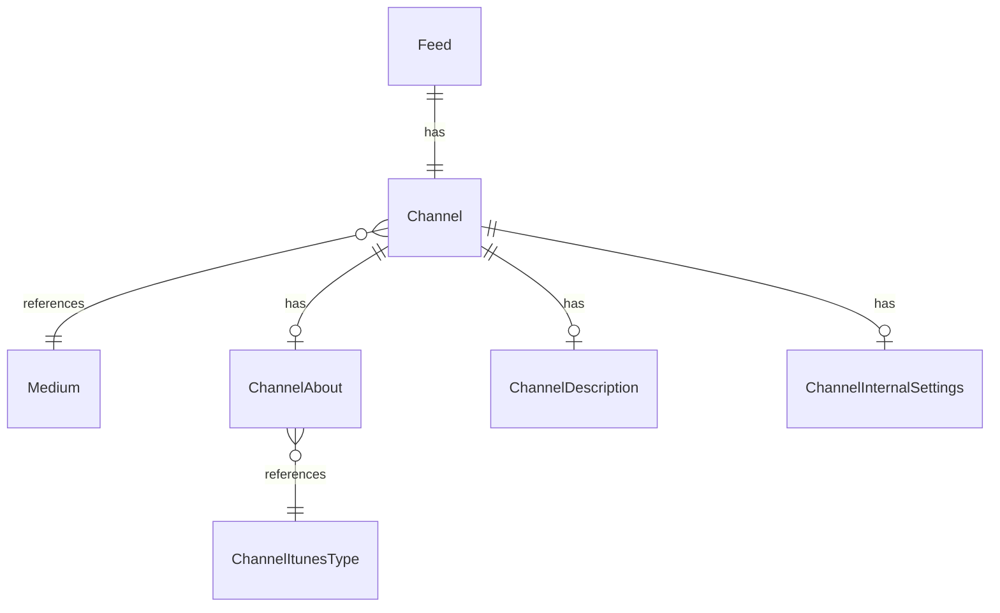

# Fake Data Generator - Channel Core

## Overview

Channel core generators create the main channel entity and its essential metadata (About, Description, InternalSettings).

## Entity Relationships



## Channel Generator

```typescript
// src/faker/generators/channel/channel.ts

import { faker } from '@faker-js/faker';
import { generateRandomIdText } from 'podverse-orm';
import { DATABASE_CONSTANTS, MediumEnum, createSortableTitle } from 'podverse-helpers';
import { GeneratedFeed } from '../feed/feed';

export interface GeneratedChannel {
  id: number;
  id_text: string;
  slug: string | null;
  feed_id: number;
  podcast_guid: string | null;
  title: string | null;
  sortable_title: string | null;
  medium_id: number;
  has_podcast_index_value: boolean;
  has_value_time_splits: boolean;
}

export class ChannelGenerator {
  private idCounter = 1;
  
  generate(feed: GeneratedFeed): GeneratedChannel {
    const title = faker.company.name() + ' ' + faker.helpers.arrayElement([
      'Podcast', 'Show', 'Radio', 'Talk', 'Weekly', 'Daily', 'Cast'
    ]);
    const sortableTitle = createSortableTitle(title)?.slice(0, DATABASE_CONSTANTS.varchar_short) || null;
    
    // Generate slug from title (50% of channels have slugs)
    const slug = faker.datatype.boolean({ probability: 0.5 })
      ? title.toLowerCase()
          .replace(/[^a-z0-9]+/g, '-')
          .replace(/^-|-$/g, '')
          .slice(0, DATABASE_CONSTANTS.varchar_slug)
      : null;
    
    const hasPodcastIndexValue = faker.datatype.boolean({ probability: 0.3 });
    
    return {
      id: this.idCounter++,
      id_text: generateRandomIdText(),
      slug,
      feed_id: feed.id,
      podcast_guid: faker.string.uuid(),
      title: title.slice(0, DATABASE_CONSTANTS.varchar_normal),
      sortable_title,
      medium_id: faker.helpers.weightedArrayElement([
        { value: MediumEnum.Podcast, weight: 7 },
        { value: MediumEnum.Video, weight: 2 },
        { value: MediumEnum.Music, weight: 1 }
      ]),
      has_podcast_index_value: hasPodcastIndexValue,
      has_value_time_splits: hasPodcastIndexValue && faker.datatype.boolean({ probability: 0.3 })
    };
  }
  
  toSQL(channel: GeneratedChannel): string {
    const slug = channel.slug ? `'${channel.slug}'` : 'NULL';
    const podcastGuid = channel.podcast_guid ? `'${channel.podcast_guid}'` : 'NULL';
    const title = channel.title ? `'${this.escapeSQL(channel.title)}'` : 'NULL';
    const sortableTitle = channel.sortable_title ? `'${this.escapeSQL(channel.sortable_title)}'` : 'NULL';
    
    return `INSERT INTO channel (id, id_text, slug, feed_id, podcast_guid, title, sortable_title, medium_id, has_podcast_index_value, has_value_time_splits) VALUES (${channel.id}, '${channel.id_text}', ${slug}, ${channel.feed_id}, ${podcastGuid}, ${title}, ${sortableTitle}, ${channel.medium_id}, ${channel.has_podcast_index_value}, ${channel.has_value_time_splits});`;
  }
  
  private escapeSQL(str: string): string {
    return str.replace(/'/g, "''");
  }
}
```

## Channel About Generator

```typescript
// src/faker/generators/channel/channelAbout.ts

import { faker } from '@faker-js/faker';
import { DATABASE_CONSTANTS } from 'podverse-helpers';
import { ChannelItunesTypeItunesTypeEnum } from 'podverse-orm';
import { GeneratedChannel } from './channel';

export interface GeneratedChannelAbout {
  id: number;
  channel_id: number;
  author: string | null;
  explicit: boolean | null;
  language: string | null;
  website_link_url: string | null;
  itunes_type: number;
  episode_count: number;
  last_pub_date: Date | null;
}

export class ChannelAboutGenerator {
  private idCounter = 1;
  private languages = ['en', 'en-us', 'en-gb', 'es', 'es-mx', 'de', 'fr', 'pt-br', 'ja', 'zh'];
  
  generate(channel: GeneratedChannel): GeneratedChannelAbout {
    return {
      id: this.idCounter++,
      channel_id: channel.id,
      author: faker.datatype.boolean({ probability: 0.9 })
        ? faker.person.fullName().slice(0, DATABASE_CONSTANTS.varchar_normal)
        : null,
      explicit: faker.helpers.arrayElement([true, false, null]),
      language: faker.helpers.arrayElement(this.languages).slice(0, DATABASE_CONSTANTS.varchar_short),
      website_link_url: faker.datatype.boolean({ probability: 0.7 })
        ? faker.internet.url().slice(0, DATABASE_CONSTANTS.varchar_url)
        : null,
      itunes_type: faker.helpers.weightedArrayElement([
        { value: ChannelItunesTypeItunesTypeEnum.Episodic, weight: 4 },
        { value: ChannelItunesTypeItunesTypeEnum.Serial, weight: 1 }
      ]),
      episode_count: faker.number.int({ min: 1, max: 500 }),
      last_pub_date: faker.date.recent({ days: 30 })
    };
  }
}
```

## Channel Description Generator

```typescript
// src/faker/generators/channel/channelDescription.ts

import { faker } from '@faker-js/faker';
import { DATABASE_CONSTANTS } from 'podverse-helpers';
import { GeneratedChannel } from './channel';

export interface GeneratedChannelDescription {
  id: number;
  channel_id: number;
  value: string;
}

export class ChannelDescriptionGenerator {
  private idCounter = 1;
  
  generate(channel: GeneratedChannel): GeneratedChannelDescription {
    return {
      id: this.idCounter++,
      channel_id: channel.id,
      value: faker.lorem.paragraphs({ min: 1, max: 3 }).slice(0, DATABASE_CONSTANTS.varchar_long)
    };
  }
}
```

## Channel Internal Settings Generator

```typescript
// src/faker/generators/channel/channelInternalSettings.ts

import { faker } from '@faker-js/faker';
import { GeneratedChannel } from './channel';

export interface GeneratedChannelInternalSettings {
  id: number;
  channel_id: number;
  live_streaming_enabled: boolean;
  comments_enabled: boolean;
}

export class ChannelInternalSettingsGenerator {
  private idCounter = 1;
  
  generate(channel: GeneratedChannel): GeneratedChannelInternalSettings {
    return {
      id: this.idCounter++,
      channel_id: channel.id,
      live_streaming_enabled: faker.datatype.boolean({ probability: 0.1 }),
      comments_enabled: faker.datatype.boolean({ probability: 0.3 })
    };
  }
}
```

## Summary

| Entity | Count for baseCount=100 |
|--------|------------------------|
| Channel | 100 (1 per feed) |
| ChannelAbout | 100 (1 per channel) |
| ChannelDescription | 100 (1 per channel) |
| ChannelInternalSettings | 100 (1 per channel) |
