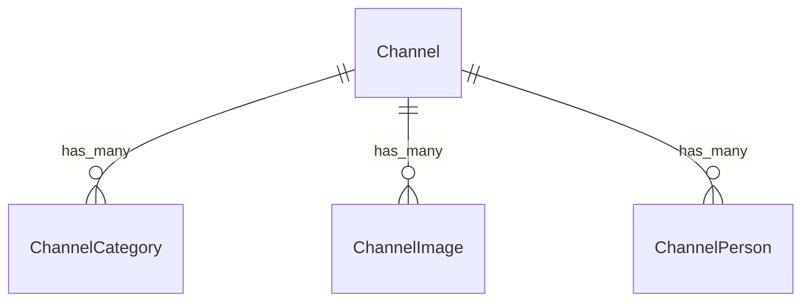

# Fake Data Generator - Channel Media

## Overview

Channel media generators create images, persons, and categories for channels. Each channel has 2 of each (as specified in requirements).

## Entity Relationships



## Channel Category Generator (2 per channel)

```typescript
// src/faker/generators/channel/channelCategory.ts

import { faker } from '@faker-js/faker';
import { CategoryEnum } from 'podverse-helpers';
import { GeneratedChannel } from './channel';

export interface GeneratedChannelCategory {
  id: number;
  channel_id: number;
  category_id: number;
}

export class ChannelCategoryGenerator {
  private idCounter = 1;
  
  generate(channel: GeneratedChannel, count: number = 2): GeneratedChannelCategory[] {
    // Get unique random categories
    const allCategories = Object.values(CategoryEnum).filter(v => typeof v === 'number') as number[];
    const selectedCategories = faker.helpers.arrayElements(allCategories, Math.min(count, allCategories.length));
    
    return selectedCategories.map(categoryId => ({
      id: this.idCounter++,
      channel_id: channel.id,
      category_id: categoryId
    }));
  }
}
```

## Channel Image Generator (2 per channel)

```typescript
// src/faker/generators/channel/channelImage.ts

import { faker } from '@faker-js/faker';
import { DATABASE_CONSTANTS } from 'podverse-helpers';
import { GeneratedChannel } from './channel';

export interface GeneratedChannelImage {
  id: number;
  channel_id: number;
  url: string;
  image_width_size: number | null;
}

export class ChannelImageGenerator {
  private idCounter = 1;
  private mediaServerBase = 'http://localhost:2111';
  private imageSizes = [3000, 1400, 600, 300, 144];
  
  generate(channel: GeneratedChannel, count: number = 2): GeneratedChannelImage[] {
    const images: GeneratedChannelImage[] = [];
    
    for (let i = 0; i < count; i++) {
      const hasWidthSize = i > 0; // First image is default (no width), others have specific widths
      
      images.push({
        id: this.idCounter++,
        channel_id: channel.id,
        url: `${this.mediaServerBase}/images/channel-${channel.id_text}-${i}.png`,
        image_width_size: hasWidthSize 
          ? faker.helpers.arrayElement(this.imageSizes)
          : null
      });
    }
    
    return images;
  }
}
```

## Channel Person Generator (2 per channel)

```typescript
// src/faker/generators/channel/channelPerson.ts

import { faker } from '@faker-js/faker';
import { DATABASE_CONSTANTS } from 'podverse-helpers';
import { GeneratedChannel } from './channel';

export interface GeneratedChannelPerson {
  id: number;
  channel_id: number;
  name: string;
  role: string | null;
  person_group: string;
  img: string | null;
  href: string | null;
}

export class ChannelPersonGenerator {
  private idCounter = 1;
  private mediaServerBase = 'http://localhost:2111';
  
  private roles = ['host', 'guest', 'producer', 'editor', 'writer', null];
  private groups = ['cast', 'crew', 'writing', 'production'];
  
  generate(channel: GeneratedChannel, count: number = 2): GeneratedChannelPerson[] {
    return Array.from({ length: count }, (_, i) => ({
      id: this.idCounter++,
      channel_id: channel.id,
      name: faker.person.fullName().slice(0, DATABASE_CONSTANTS.varchar_normal),
      role: faker.helpers.arrayElement(this.roles)?.slice(0, DATABASE_CONSTANTS.varchar_normal) || null,
      person_group: faker.helpers.arrayElement(this.groups).slice(0, DATABASE_CONSTANTS.varchar_normal),
      img: faker.datatype.boolean({ probability: 0.7 })
        ? `${this.mediaServerBase}/images/person-${channel.id}-${i}.png`
        : null,
      href: faker.datatype.boolean({ probability: 0.5 })
        ? faker.internet.url().slice(0, DATABASE_CONSTANTS.varchar_url)
        : null
    }));
  }
}
```

## Summary

| Entity | Count for baseCount=100 |
|--------|------------------------|
| ChannelCategory | 200 (2 per channel) |
| ChannelImage | 200 (2 per channel) |
| ChannelPerson | 200 (2 per channel) |
