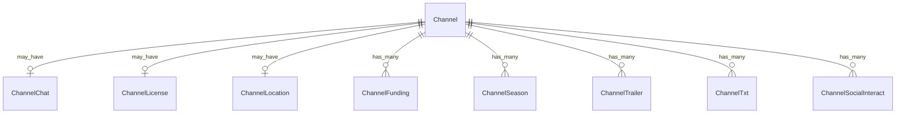

# Fake Data Generator - Channel Extras

## Overview

Channel extras generators create optional metadata entities like chat, license, location, funding, seasons, trailers, txt records, and social interaction links.

## Entity Relationships



## Channel Chat Generator

```typescript
// src/faker/generators/channel/channelChat.ts

import { faker } from '@faker-js/faker';
import { DATABASE_CONSTANTS } from 'podverse-helpers';
import { GeneratedChannel } from './channel';

export interface GeneratedChannelChat {
  id: number;
  channel_id: number;
  server: string | null;
  protocol: string;
  account_id: string | null;
  space: string | null;
}

export class ChannelChatGenerator {
  private idCounter = 1;
  
  generate(channel: GeneratedChannel): GeneratedChannelChat | null {
    // 10% of channels have chat
    if (!faker.datatype.boolean({ probability: 0.1 })) return null;
    
    const protocol = faker.helpers.arrayElement(['irc', 'xmpp', 'matrix', 'nostr']);
    
    return {
      id: this.idCounter++,
      channel_id: channel.id,
      server: `chat.${faker.internet.domainName()}`.slice(0, DATABASE_CONSTANTS.varchar_fqdn),
      protocol: protocol.slice(0, DATABASE_CONSTANTS.varchar_short),
      account_id: faker.string.alphanumeric(20).slice(0, DATABASE_CONSTANTS.varchar_normal),
      space: faker.datatype.boolean({ probability: 0.5 })
        ? `#${faker.lorem.word()}`.slice(0, DATABASE_CONSTANTS.varchar_normal)
        : null
    };
  }
}
```

## Channel License Generator

```typescript
// src/faker/generators/channel/channelLicense.ts

import { faker } from '@faker-js/faker';
import { DATABASE_CONSTANTS } from 'podverse-helpers';
import { GeneratedChannel } from './channel';

export interface GeneratedChannelLicense {
  id: number;
  channel_id: number;
  identifier: string;
  url: string | null;
}

export class ChannelLicenseGenerator {
  private idCounter = 1;
  
  private licenses = [
    { identifier: 'CC-BY-4.0', url: 'https://creativecommons.org/licenses/by/4.0/' },
    { identifier: 'CC-BY-SA-4.0', url: 'https://creativecommons.org/licenses/by-sa/4.0/' },
    { identifier: 'CC-BY-NC-4.0', url: 'https://creativecommons.org/licenses/by-nc/4.0/' },
    { identifier: 'CC0-1.0', url: 'https://creativecommons.org/publicdomain/zero/1.0/' },
    { identifier: 'All Rights Reserved', url: null }
  ];
  
  generate(channel: GeneratedChannel): GeneratedChannelLicense | null {
    // 20% of channels have explicit license
    if (!faker.datatype.boolean({ probability: 0.2 })) return null;
    
    const license = faker.helpers.arrayElement(this.licenses);
    
    return {
      id: this.idCounter++,
      channel_id: channel.id,
      identifier: license.identifier.slice(0, DATABASE_CONSTANTS.varchar_normal),
      url: license.url?.slice(0, DATABASE_CONSTANTS.varchar_url) || null
    };
  }
}
```

## Channel Location Generator

```typescript
// src/faker/generators/channel/channelLocation.ts

import { faker } from '@faker-js/faker';
import { DATABASE_CONSTANTS } from 'podverse-helpers';
import { GeneratedChannel } from './channel';

export interface GeneratedChannelLocation {
  id: number;
  channel_id: number;
  geo: string | null;
  osm: string | null;
  name: string | null;
}

export class ChannelLocationGenerator {
  private idCounter = 1;
  
  generate(channel: GeneratedChannel): GeneratedChannelLocation | null {
    // 15% of channels have location
    if (!faker.datatype.boolean({ probability: 0.15 })) return null;
    
    const lat = faker.location.latitude();
    const lon = faker.location.longitude();
    
    return {
      id: this.idCounter++,
      channel_id: channel.id,
      geo: `geo:${lat},${lon}`.slice(0, DATABASE_CONSTANTS.varchar_normal),
      osm: faker.datatype.boolean({ probability: 0.5 })
        ? `R${faker.number.int({ min: 1000000, max: 9999999 })}`.slice(0, DATABASE_CONSTANTS.varchar_normal)
        : null,
      name: faker.location.city().slice(0, DATABASE_CONSTANTS.varchar_normal)
    };
  }
}
```

## Channel Funding Generator

```typescript
// src/faker/generators/channel/channelFunding.ts

import { faker } from '@faker-js/faker';
import { DATABASE_CONSTANTS } from 'podverse-helpers';
import { GeneratedChannel } from './channel';

export interface GeneratedChannelFunding {
  id: number;
  channel_id: number;
  url: string;
  title: string | null;
}

export class ChannelFundingGenerator {
  private idCounter = 1;
  
  private fundingPlatforms = [
    { name: 'Patreon', urlBase: 'https://www.patreon.com/' },
    { name: 'Buy Me a Coffee', urlBase: 'https://www.buymeacoffee.com/' },
    { name: 'Ko-fi', urlBase: 'https://ko-fi.com/' },
    { name: 'PayPal', urlBase: 'https://www.paypal.me/' },
    { name: 'Support', urlBase: 'https://example.com/support/' }
  ];
  
  generate(channel: GeneratedChannel): GeneratedChannelFunding[] {
    // 50% of channels have funding links
    if (!faker.datatype.boolean({ probability: 0.5 })) return [];
    
    const count = faker.number.int({ min: 1, max: 2 });
    const selectedPlatforms = faker.helpers.arrayElements(this.fundingPlatforms, count);
    
    return selectedPlatforms.map(platform => ({
      id: this.idCounter++,
      channel_id: channel.id,
      url: (platform.urlBase + faker.internet.username()).slice(0, DATABASE_CONSTANTS.varchar_url),
      title: faker.datatype.boolean({ probability: 0.8 })
        ? `Support us on ${platform.name}`.slice(0, DATABASE_CONSTANTS.varchar_normal)
        : null
    }));
  }
}
```

## Channel Season Generator

```typescript
// src/faker/generators/channel/channelSeason.ts

import { faker } from '@faker-js/faker';
import { DATABASE_CONSTANTS } from 'podverse-helpers';
import { GeneratedChannel } from './channel';

export interface GeneratedChannelSeason {
  id: number;
  channel_id: number;
  number: number;
  name: string | null;
}

export class ChannelSeasonGenerator {
  private idCounter = 1;
  
  generate(channel: GeneratedChannel): GeneratedChannelSeason[] {
    // 30% of channels have seasons
    if (!faker.datatype.boolean({ probability: 0.3 })) return [];
    
    const seasonCount = faker.number.int({ min: 1, max: 5 });
    
    return Array.from({ length: seasonCount }, (_, i) => ({
      id: this.idCounter++,
      channel_id: channel.id,
      number: i + 1,
      name: faker.datatype.boolean({ probability: 0.6 })
        ? `Season ${i + 1}: ${faker.lorem.words({ min: 2, max: 4 })}`.slice(0, DATABASE_CONSTANTS.varchar_normal)
        : null
    }));
  }
}
```

## Channel Trailer Generator

```typescript
// src/faker/generators/channel/channelTrailer.ts

import { faker } from '@faker-js/faker';
import { DATABASE_CONSTANTS } from 'podverse-helpers';
import { GeneratedChannel } from './channel';

export interface GeneratedChannelTrailer {
  id: number;
  channel_id: number;
  url: string;
  title: string | null;
  pub_date: Date | null;
  length: number | null;
  type: string | null;
  season: number | null;
}

export class ChannelTrailerGenerator {
  private idCounter = 1;
  private mediaServerBase = 'http://localhost:2111';
  
  generate(channel: GeneratedChannel): GeneratedChannelTrailer[] {
    // 20% of channels have trailers
    if (!faker.datatype.boolean({ probability: 0.2 })) return [];
    
    const count = faker.number.int({ min: 1, max: 2 });
    
    return Array.from({ length: count }, (_, i) => ({
      id: this.idCounter++,
      channel_id: channel.id,
      url: `${this.mediaServerBase}/audio/trailer-${channel.id}-${i}.mp3`,
      title: faker.datatype.boolean({ probability: 0.7 })
        ? `Trailer${i > 0 ? ` ${i + 1}` : ''}`.slice(0, DATABASE_CONSTANTS.varchar_normal)
        : null,
      pub_date: faker.date.past({ years: 2 }),
      length: faker.number.int({ min: 30, max: 180 }),
      type: 'audio/mpeg'.slice(0, DATABASE_CONSTANTS.varchar_short),
      season: faker.datatype.boolean({ probability: 0.3 })
        ? faker.number.int({ min: 1, max: 3 })
        : null
    }));
  }
}
```

## Channel Txt Generator

```typescript
// src/faker/generators/channel/channelTxt.ts

import { faker } from '@faker-js/faker';
import { DATABASE_CONSTANTS } from 'podverse-helpers';
import { GeneratedChannel } from './channel';

export interface GeneratedChannelTxt {
  id: number;
  channel_id: number;
  purpose: string | null;
  value: string;
}

export class ChannelTxtGenerator {
  private idCounter = 1;
  
  generate(channel: GeneratedChannel): GeneratedChannelTxt[] {
    // 10% of channels have txt records
    if (!faker.datatype.boolean({ probability: 0.1 })) return [];
    
    const purposes = ['verify', 'release', null];
    const count = faker.number.int({ min: 1, max: 2 });
    
    return Array.from({ length: count }, () => ({
      id: this.idCounter++,
      channel_id: channel.id,
      purpose: faker.helpers.arrayElement(purposes)?.slice(0, DATABASE_CONSTANTS.varchar_normal) || null,
      value: faker.string.alphanumeric({ length: { min: 20, max: 100 } }).slice(0, DATABASE_CONSTANTS.varchar_long)
    }));
  }
}
```

## Channel Social Interact Generator

```typescript
// src/faker/generators/channel/channelSocialInteract.ts

import { faker } from '@faker-js/faker';
import { DATABASE_CONSTANTS } from 'podverse-helpers';
import { GeneratedChannel } from './channel';

export interface GeneratedChannelSocialInteract {
  id: number;
  channel_id: number;
  protocol: string;
  uri: string;
  account_id: string | null;
  account_url: string | null;
  priority: number | null;
}

export class ChannelSocialInteractGenerator {
  private idCounter = 1;
  
  generate(channel: GeneratedChannel): GeneratedChannelSocialInteract[] {
    // 25% of channels have social interact
    if (!faker.datatype.boolean({ probability: 0.25 })) return [];
    
    const platforms = [
      { protocol: 'activitypub', uriBase: 'https://mastodon.social/@' },
      { protocol: 'twitter', uriBase: 'https://twitter.com/' },
      { protocol: 'bluesky', uriBase: 'https://bsky.app/profile/' }
    ];
    
    const count = faker.number.int({ min: 1, max: 2 });
    const selected = faker.helpers.arrayElements(platforms, count);
    
    return selected.map((platform, i) => ({
      id: this.idCounter++,
      channel_id: channel.id,
      protocol: platform.protocol.slice(0, DATABASE_CONSTANTS.varchar_short),
      uri: (platform.uriBase + faker.internet.username()).slice(0, DATABASE_CONSTANTS.varchar_uri),
      account_id: faker.internet.username().slice(0, DATABASE_CONSTANTS.varchar_normal),
      account_url: (platform.uriBase + faker.internet.username()).slice(0, DATABASE_CONSTANTS.varchar_url),
      priority: i + 1
    }));
  }
}
```

## Summary

| Entity | Count for baseCount=100 |
|--------|------------------------|
| ChannelChat | ~10 (10% have chat) |
| ChannelLicense | ~20 (20% have license) |
| ChannelLocation | ~15 (15% have location) |
| ChannelFunding | ~75 (50% have 1-2) |
| ChannelSeason | ~75 (30% have 1-5) |
| ChannelTrailer | ~30 (20% have 1-2) |
| ChannelTxt | ~15 (10% have 1-2) |
| ChannelSocialInteract | ~37 (25% have 1-2) |
