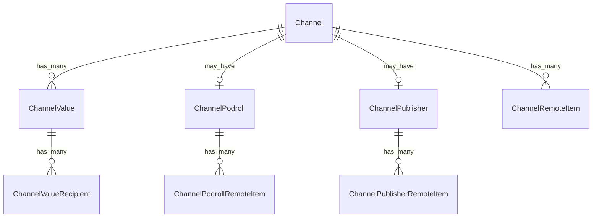

# Fake Data Generator - Channel Value & Podroll

## Overview

Channel value generators create Value4Value payment splits. Podroll, Publisher, and RemoteItem generators create cross-podcast linking data.

## Entity Relationships



## Channel Value Generator with Recipients

```typescript
// src/faker/generators/channel/channelValue.ts

import { faker } from '@faker-js/faker';
import { DATABASE_CONSTANTS } from 'podverse-helpers';
import { GeneratedChannel } from './channel';

export interface GeneratedChannelValue {
  id: number;
  channel_id: number;
  type: string;
  method: string;
  suggested: number | null;
}

export interface GeneratedChannelValueRecipient {
  id: number;
  channel_value_id: number;
  type: string;
  address: string;
  split: number;
  name: string | null;
  custom_key: string | null;
  custom_value: string | null;
  fee: boolean;
}

export class ChannelValueGenerator {
  private valueIdCounter = 1;
  private recipientIdCounter = 1;
  
  generate(channel: GeneratedChannel): {
    value: GeneratedChannelValue | null;
    recipients: GeneratedChannelValueRecipient[];
  } {
    // Only generate for channels with value enabled
    if (!channel.has_podcast_index_value) {
      return { value: null, recipients: [] };
    }
    
    const valueId = this.valueIdCounter++;
    
    const value: GeneratedChannelValue = {
      id: valueId,
      channel_id: channel.id,
      type: 'lightning',
      method: 'keysend',
      suggested: faker.datatype.boolean({ probability: 0.5 })
        ? faker.number.float({ min: 0.00001, max: 0.001, fractionDigits: 8 })
        : null
    };
    
    // Generate 2-5 recipients that sum to ~100 split
    const recipientCount = faker.number.int({ min: 2, max: 5 });
    const recipients: GeneratedChannelValueRecipient[] = [];
    let remainingSplit = 100;
    
    for (let i = 0; i < recipientCount; i++) {
      const isLast = i === recipientCount - 1;
      const split = isLast 
        ? remainingSplit 
        : faker.number.int({ min: 5, max: Math.min(50, remainingSplit - (recipientCount - i - 1) * 5) });
      
      remainingSplit -= split;
      
      recipients.push({
        id: this.recipientIdCounter++,
        channel_value_id: valueId,
        type: 'node',
        address: faker.string.hexadecimal({ length: 66, casing: 'lower' }).slice(2), // 66 char pubkey
        split,
        name: faker.datatype.boolean({ probability: 0.7 })
          ? faker.person.fullName().slice(0, DATABASE_CONSTANTS.varchar_normal)
          : null,
        custom_key: faker.datatype.boolean({ probability: 0.3 })
          ? faker.string.numeric(8)
          : null,
        custom_value: faker.datatype.boolean({ probability: 0.3 })
          ? faker.string.alphanumeric(20)
          : null,
        fee: i === 0 && faker.datatype.boolean({ probability: 0.2 }) // First recipient might be a fee
      });
    }
    
    return { value, recipients };
  }
}
```

## Channel Podroll Generator

```typescript
// src/faker/generators/channel/channelPodroll.ts

import { faker } from '@faker-js/faker';
import { DATABASE_CONSTANTS } from 'podverse-helpers';
import { GeneratedChannel } from './channel';

export interface GeneratedChannelPodroll {
  id: number;
  channel_id: number;
}

export interface GeneratedChannelPodrollRemoteItem {
  id: number;
  channel_podroll_id: number;
  feed_guid: string;
  feed_url: string | null;
  item_guid: string | null;
  title: string | null;
}

export class ChannelPodrollGenerator {
  private podrollIdCounter = 1;
  private remoteItemIdCounter = 1;
  private mediaServerBase = 'http://localhost:2111';
  
  generate(channel: GeneratedChannel): {
    podroll: GeneratedChannelPodroll | null;
    remoteItems: GeneratedChannelPodrollRemoteItem[];
  } {
    // 15% of channels have podroll
    if (!faker.datatype.boolean({ probability: 0.15 })) {
      return { podroll: null, remoteItems: [] };
    }
    
    const podrollId = this.podrollIdCounter++;
    const podroll: GeneratedChannelPodroll = {
      id: podrollId,
      channel_id: channel.id
    };
    
    // Generate 2-5 remote items
    const count = faker.number.int({ min: 2, max: 5 });
    const remoteItems: GeneratedChannelPodrollRemoteItem[] = Array.from(
      { length: count },
      () => ({
        id: this.remoteItemIdCounter++,
        channel_podroll_id: podrollId,
        feed_guid: faker.string.uuid().slice(0, DATABASE_CONSTANTS.varchar_guid),
        feed_url: faker.datatype.boolean({ probability: 0.7 })
          ? `${this.mediaServerBase}/rss/${faker.number.int({ min: 1, max: 1000 })}.xml`
          : null,
        item_guid: null, // Podroll items typically don't have item guids
        title: null
      })
    );
    
    return { podroll, remoteItems };
  }
}
```

## Channel Publisher Generator

```typescript
// src/faker/generators/channel/channelPublisher.ts

import { faker } from '@faker-js/faker';
import { DATABASE_CONSTANTS } from 'podverse-helpers';
import { GeneratedChannel } from './channel';

export interface GeneratedChannelPublisher {
  id: number;
  channel_id: number;
}

export interface GeneratedChannelPublisherRemoteItem {
  id: number;
  channel_publisher_id: number;
  feed_guid: string;
  feed_url: string | null;
  item_guid: string | null;
  title: string | null;
}

export class ChannelPublisherGenerator {
  private publisherIdCounter = 1;
  private remoteItemIdCounter = 1;
  private mediaServerBase = 'http://localhost:2111';
  
  generate(channel: GeneratedChannel): {
    publisher: GeneratedChannelPublisher | null;
    remoteItems: GeneratedChannelPublisherRemoteItem[];
  } {
    // 10% of channels have publisher
    if (!faker.datatype.boolean({ probability: 0.1 })) {
      return { publisher: null, remoteItems: [] };
    }
    
    const publisherId = this.publisherIdCounter++;
    const publisher: GeneratedChannelPublisher = {
      id: publisherId,
      channel_id: channel.id
    };
    
    // Publisher typically has 1 remote item
    const remoteItems: GeneratedChannelPublisherRemoteItem[] = [{
      id: this.remoteItemIdCounter++,
      channel_publisher_id: publisherId,
      feed_guid: faker.string.uuid().slice(0, DATABASE_CONSTANTS.varchar_guid),
      feed_url: `${this.mediaServerBase}/rss/${faker.number.int({ min: 1, max: 1000 })}.xml`,
      item_guid: null,
      title: null
    }];
    
    return { publisher, remoteItems };
  }
}
```

## Channel Remote Item Generator

```typescript
// src/faker/generators/channel/channelRemoteItem.ts

import { faker } from '@faker-js/faker';
import { DATABASE_CONSTANTS } from 'podverse-helpers';
import { GeneratedChannel } from './channel';

export interface GeneratedChannelRemoteItem {
  id: number;
  channel_id: number;
  feed_guid: string;
  feed_url: string | null;
  item_guid: string | null;
  title: string | null;
}

export class ChannelRemoteItemGenerator {
  private idCounter = 1;
  private mediaServerBase = 'http://localhost:2111';
  
  generate(channel: GeneratedChannel): GeneratedChannelRemoteItem[] {
    // 10% of channels have remote items
    if (!faker.datatype.boolean({ probability: 0.1 })) return [];
    
    const count = faker.number.int({ min: 1, max: 3 });
    
    return Array.from({ length: count }, () => ({
      id: this.idCounter++,
      channel_id: channel.id,
      feed_guid: faker.string.uuid().slice(0, DATABASE_CONSTANTS.varchar_guid),
      feed_url: `${this.mediaServerBase}/rss/${faker.number.int({ min: 1, max: 1000 })}.xml`,
      item_guid: faker.datatype.boolean({ probability: 0.5 })
        ? faker.string.uuid().slice(0, DATABASE_CONSTANTS.varchar_normal)
        : null,
      title: null
    }));
  }
}
```

## Summary

| Entity | Count for baseCount=100 |
|--------|------------------------|
| ChannelValue | ~30 (30% have value) |
| ChannelValueRecipient | ~90 (2-5 per value) |
| ChannelPodroll | ~15 (15% have podroll) |
| ChannelPodrollRemoteItem | ~52 (2-5 per podroll) |
| ChannelPublisher | ~10 (10% have publisher) |
| ChannelPublisherRemoteItem | ~10 (1 per publisher) |
| ChannelRemoteItem | ~20 (10% have 1-3) |
