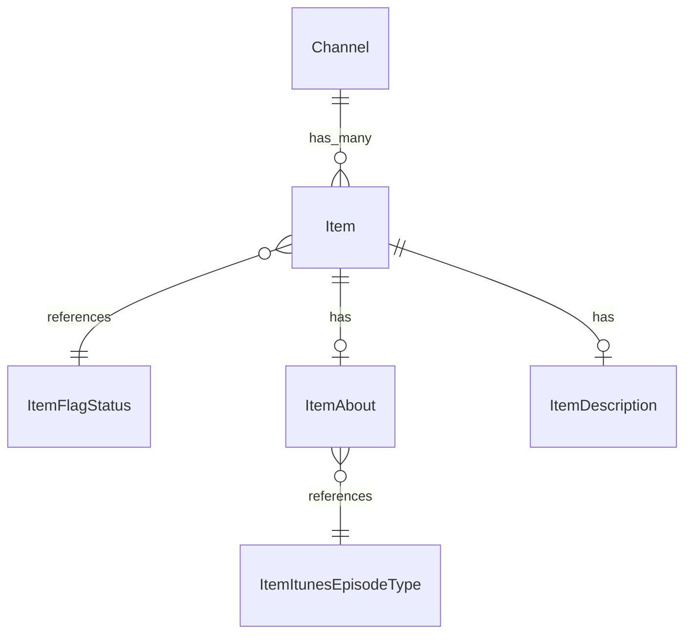

# Fake Data Generator - Item Core

## Overview

Item core generators create the main item (episode) entity and its essential metadata (About, Description). Each channel has 2 items by default.

## Entity Relationships



## Item Generator (2 per channel)

```typescript
// src/faker/generators/item/item.ts

import { faker } from '@faker-js/faker';
import { generateRandomIdText } from 'podverse-orm';
import { DATABASE_CONSTANTS, formatGuidEnclosureUrl } from 'podverse-helpers';
import { ItemFlagStatusStatusEnum } from 'podverse-orm';
import { GeneratedChannel } from '../channel/channel';

export interface GeneratedItem {
  id: number;
  id_text: string;
  slug: string | null;
  channel_id: number;
  guid: string | null;
  guid_enclosure_url: string | null;
  pub_date: Date | null;
  title: string | null;
  item_flag_status_id: number;
  // Helper fields for generation
  channelHasValueTimeSplits: boolean;
}

export class ItemGenerator {
  private idCounter = 1;
  private mediaServerBase = 'http://localhost:2111';
  
  generate(channel: GeneratedChannel, itemsPerChannel: number = 2): GeneratedItem[] {
    const items: GeneratedItem[] = [];
    
    for (let i = 0; i < itemsPerChannel; i++) {
      const enclosureUrl = `${this.mediaServerBase}/audio/item-${channel.id}-${i}.mp3`;
      const guid = faker.string.uuid();
      const title = this.generateEpisodeTitle(i);
      
      // Generate slug (40% of items have slugs)
      const slug = faker.datatype.boolean({ probability: 0.4 })
        ? title.toLowerCase()
            .replace(/[^a-z0-9]+/g, '-')
            .replace(/^-|-$/g, '')
            .slice(0, DATABASE_CONSTANTS.varchar_slug)
        : null;
      
      items.push({
        id: this.idCounter++,
        id_text: generateRandomIdText(),
        slug,
        channel_id: channel.id,
        guid: guid.slice(0, DATABASE_CONSTANTS.varchar_url),
        guid_enclosure_url: formatGuidEnclosureUrl(enclosureUrl),
        pub_date: faker.date.past({ years: 2, refDate: new Date() }),
        title: title.slice(0, DATABASE_CONSTANTS.varchar_normal),
        item_flag_status_id: ItemFlagStatusStatusEnum.Active,
        channelHasValueTimeSplits: channel.has_value_time_splits
      });
    }
    
    // Sort by pub_date descending (newest first)
    items.sort((a, b) => (b.pub_date?.getTime() || 0) - (a.pub_date?.getTime() || 0));
    
    return items;
  }
  
  private generateEpisodeTitle(index: number): string {
    const formats = [
      () => `Episode ${faker.number.int({ min: 1, max: 500 })}: ${faker.lorem.sentence({ min: 3, max: 8 })}`,
      () => `#${faker.number.int({ min: 1, max: 500 })} - ${faker.lorem.sentence({ min: 3, max: 6 })}`,
      () => faker.lorem.sentence({ min: 4, max: 10 }),
      () => `${faker.person.fullName()} on ${faker.lorem.words({ min: 2, max: 4 })}`,
      () => `The ${faker.lorem.words({ min: 2, max: 4 })} Episode`
    ];
    
    return faker.helpers.arrayElement(formats)();
  }
  
  toSQL(item: GeneratedItem): string {
    const slug = item.slug ? `'${item.slug}'` : 'NULL';
    const guid = item.guid ? `'${item.guid}'` : 'NULL';
    const guidEnclosureUrl = item.guid_enclosure_url ? `'${item.guid_enclosure_url}'` : 'NULL';
    const pubDate = item.pub_date ? `'${item.pub_date.toISOString()}'` : 'NULL';
    const title = item.title ? `'${this.escapeSQL(item.title)}'` : 'NULL';
    
    return `INSERT INTO item (id, id_text, slug, channel_id, guid, guid_enclosure_url, pub_date, title, item_flag_status_id) VALUES (${item.id}, '${item.id_text}', ${slug}, ${item.channel_id}, ${guid}, ${guidEnclosureUrl}, ${pubDate}, ${title}, ${item.item_flag_status_id});`;
  }
  
  private escapeSQL(str: string): string {
    return str.replace(/'/g, "''");
  }
}
```

## Item About Generator

```typescript
// src/faker/generators/item/itemAbout.ts

import { faker } from '@faker-js/faker';
import { DATABASE_CONSTANTS } from 'podverse-helpers';
import { ItemItunesEpisodeTypeEnum } from 'podverse-orm';
import { GeneratedItem } from './item';

export interface GeneratedItemAbout {
  id: number;
  item_id: number;
  duration: string | null;
  explicit: boolean;
  website_link_url: string | null;
  item_itunes_episode_type: number;
}

export class ItemAboutGenerator {
  private idCounter = 1;
  
  generate(item: GeneratedItem): GeneratedItemAbout {
    // Duration between 5 minutes and 3 hours
    const durationSeconds = faker.number.int({ min: 300, max: 10800 });
    
    return {
      id: this.idCounter++,
      item_id: item.id,
      duration: durationSeconds.toFixed(2),
      explicit: faker.datatype.boolean({ probability: 0.1 }),
      website_link_url: faker.datatype.boolean({ probability: 0.5 })
        ? faker.internet.url().slice(0, DATABASE_CONSTANTS.varchar_url)
        : null,
      item_itunes_episode_type: faker.helpers.weightedArrayElement([
        { value: ItemItunesEpisodeTypeEnum.Full, weight: 8 },
        { value: ItemItunesEpisodeTypeEnum.Trailer, weight: 1 },
        { value: ItemItunesEpisodeTypeEnum.Bonus, weight: 1 }
      ])
    };
  }
}
```

## Item Description Generator

```typescript
// src/faker/generators/item/itemDescription.ts

import { faker } from '@faker-js/faker';
import { DATABASE_CONSTANTS } from 'podverse-helpers';
import { GeneratedItem } from './item';

export interface GeneratedItemDescription {
  id: number;
  item_id: number;
  value: string;
}

export class ItemDescriptionGenerator {
  private idCounter = 1;
  
  generate(item: GeneratedItem): GeneratedItemDescription {
    // Generate HTML-like description with show notes style
    const paragraphs = faker.number.int({ min: 1, max: 4 });
    let description = '';
    
    for (let i = 0; i < paragraphs; i++) {
      description += `<p>${faker.lorem.paragraph()}</p>\n`;
    }
    
    // Add some show notes elements
    if (faker.datatype.boolean({ probability: 0.5 })) {
      description += '<h3>Links mentioned:</h3>\n<ul>\n';
      const linkCount = faker.number.int({ min: 2, max: 5 });
      for (let i = 0; i < linkCount; i++) {
        description += `<li><a href="${faker.internet.url()}">${faker.lorem.words({ min: 2, max: 5 })}</a></li>\n`;
      }
      description += '</ul>\n';
    }
    
    return {
      id: this.idCounter++,
      item_id: item.id,
      value: description.slice(0, DATABASE_CONSTANTS.varchar_long)
    };
  }
}
```

## Summary

| Entity | Count for baseCount=100 |
|--------|------------------------|
| Item | 200 (2 per channel) |
| ItemAbout | 200 (1 per item) |
| ItemDescription | 200 (1 per item) |
