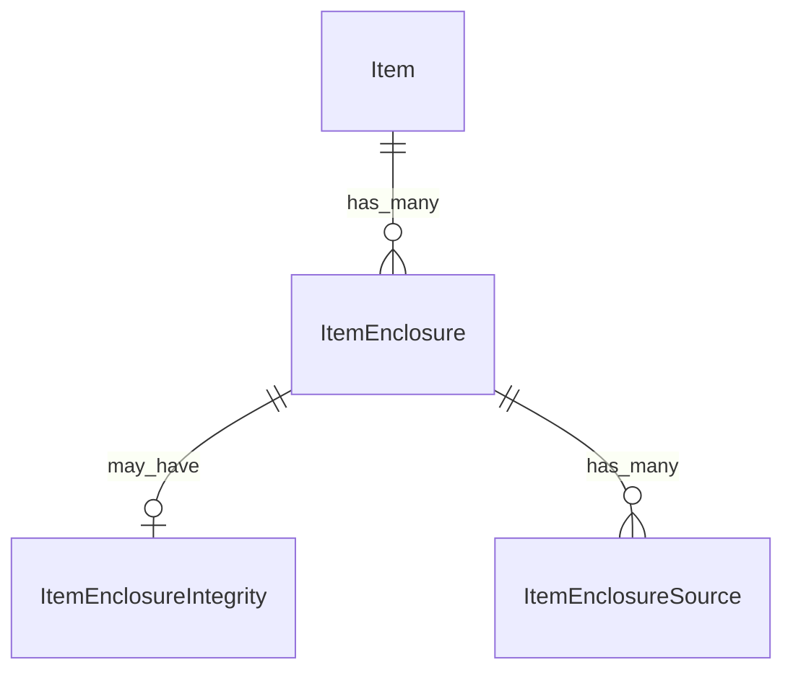

# Fake Data Generator - Item Enclosure

## Overview

Item enclosure generators create media files associated with items, including enclosures, sources, and integrity hashes. Each item has 2 enclosures by default.

## Entity Relationships



## Item Enclosure Generator (2 per item)

```typescript
// src/faker/generators/item/itemEnclosure.ts

import { faker } from '@faker-js/faker';
import { DATABASE_CONSTANTS } from 'podverse-helpers';
import { GeneratedItem } from './item';

export interface GeneratedItemEnclosure {
  id: number;
  item_id: number;
  type: string;
  length: number | null;
  bitrate: number | null;
  height: number | null;
  language: string | null;
  title: string | null;
  rel: string | null;
  codecs: string | null;
  item_enclosure_default: boolean;
}

export interface GeneratedItemEnclosureIntegrity {
  id: number;
  item_enclosure_id: number;
  type: string;
  value: string;
}

export interface GeneratedItemEnclosureSource {
  id: number;
  item_enclosure_id: number;
  uri: string;
  content_type: string | null;
}

export class ItemEnclosureGenerator {
  private enclosureIdCounter = 1;
  private integrityIdCounter = 1;
  private sourceIdCounter = 1;
  private mediaServerBase = 'http://localhost:2111';
  
  private audioTypes = [
    { type: 'audio/mpeg', ext: 'mp3', bitrates: [64, 128, 192, 256, 320] },
    { type: 'audio/ogg', ext: 'ogg', bitrates: [96, 128, 192] },
    { type: 'audio/opus', ext: 'opus', bitrates: [48, 96, 128] }
  ];
  
  private videoTypes = [
    { type: 'video/mp4', ext: 'mp4', heights: [360, 480, 720, 1080] },
    { type: 'video/webm', ext: 'webm', heights: [360, 480, 720, 1080] }
  ];
  
  generate(item: GeneratedItem, count: number = 2): {
    enclosures: GeneratedItemEnclosure[];
    integrities: GeneratedItemEnclosureIntegrity[];
    sources: GeneratedItemEnclosureSource[];
  } {
    const enclosures: GeneratedItemEnclosure[] = [];
    const integrities: GeneratedItemEnclosureIntegrity[] = [];
    const sources: GeneratedItemEnclosureSource[] = [];
    
    // Determine if audio or video based on item index
    const isVideo = faker.datatype.boolean({ probability: 0.2 });
    const mediaTypes = isVideo ? this.videoTypes : this.audioTypes;
    
    for (let i = 0; i < count; i++) {
      const isDefault = i === 0;
      const mediaType = isDefault 
        ? mediaTypes[0] 
        : faker.helpers.arrayElement(mediaTypes);
      
      const enclosureId = this.enclosureIdCounter++;
      
      // Create enclosure
      const enclosure: GeneratedItemEnclosure = {
        id: enclosureId,
        item_id: item.id,
        type: mediaType.type.slice(0, DATABASE_CONSTANTS.varchar_short),
        length: faker.number.int({ min: 1000000, max: 500000000 }),
        bitrate: !isVideo ? faker.helpers.arrayElement((mediaType as any).bitrates) : null,
        height: isVideo ? faker.helpers.arrayElement((mediaType as any).heights) : null,
        language: faker.datatype.boolean({ probability: 0.3 })
          ? faker.helpers.arrayElement(['en', 'es', 'de', 'fr'])
          : null,
        title: !isDefault && faker.datatype.boolean({ probability: 0.5 })
          ? faker.lorem.words({ min: 2, max: 4 }).slice(0, DATABASE_CONSTANTS.varchar_short)
          : null,
        rel: !isDefault ? faker.helpers.arrayElement(['alternate', null]) : null,
        codecs: faker.datatype.boolean({ probability: 0.3 })
          ? (isVideo ? 'avc1.64001f' : 'mp3').slice(0, DATABASE_CONSTANTS.varchar_short)
          : null,
        item_enclosure_default: isDefault
      };
      enclosures.push(enclosure);
      
      // Create integrity (30% of non-default enclosures)
      if (!isDefault && faker.datatype.boolean({ probability: 0.3 })) {
        integrities.push({
          id: this.integrityIdCounter++,
          item_enclosure_id: enclosureId,
          type: 'sri',
          value: `sha384-${faker.string.alphanumeric(64)}`
        });
      }
      
      // Create sources (1-3 per enclosure)
      const sourceCount = isDefault ? 1 : faker.number.int({ min: 1, max: 3 });
      for (let j = 0; j < sourceCount; j++) {
        const ext = (mediaType as any).ext;
        sources.push({
          id: this.sourceIdCounter++,
          item_enclosure_id: enclosureId,
          uri: `${this.mediaServerBase}/${isVideo ? 'video' : 'audio'}/item-${item.id}-enc-${i}-src-${j}.${ext}`.slice(0, DATABASE_CONSTANTS.varchar_uri),
          content_type: j > 0 
            ? faker.helpers.arrayElement(mediaTypes).type.slice(0, DATABASE_CONSTANTS.varchar_short)
            : null
        });
      }
    }
    
    return { enclosures, integrities, sources };
  }
}
```

## Summary

| Entity | Count for baseCount=100 |
|--------|------------------------|
| ItemEnclosure | 400 (2 per item) |
| ItemEnclosureIntegrity | ~60 (30% of non-default enclosures) |
| ItemEnclosureSource | ~600 (1-3 per enclosure) |
