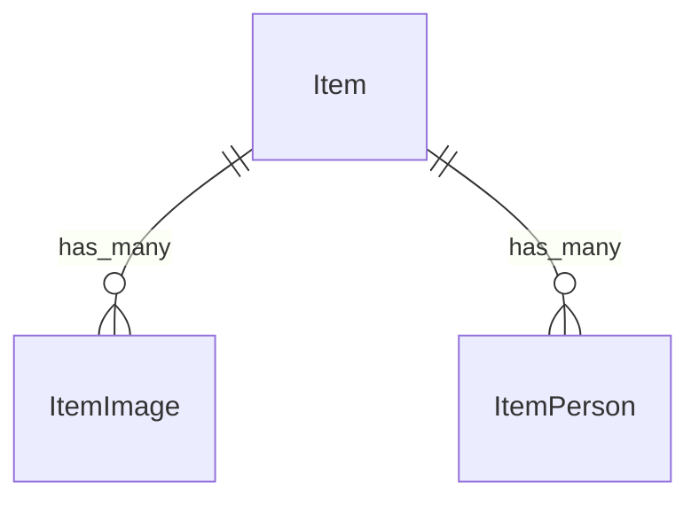

# Fake Data Generator - Item Media

## Overview

Item media generators create images and persons for items. Each item has 2 of each by default.

## Entity Relationships



## Item Image Generator (2 per item)

```typescript
// src/faker/generators/item/itemImage.ts

import { faker } from '@faker-js/faker';
import { DATABASE_CONSTANTS } from 'podverse-helpers';
import { GeneratedItem } from './item';

export interface GeneratedItemImage {
  id: number;
  item_id: number;
  url: string;
  image_width_size: number | null;
}

export class ItemImageGenerator {
  private idCounter = 1;
  private mediaServerBase = 'http://localhost:2111';
  private imageSizes = [3000, 1400, 600, 300, 144];
  
  generate(item: GeneratedItem, count: number = 2): GeneratedItemImage[] {
    return Array.from({ length: count }, (_, i) => ({
      id: this.idCounter++,
      item_id: item.id,
      url: `${this.mediaServerBase}/images/item-${item.id_text}-${i}.png`,
      image_width_size: i > 0 
        ? faker.helpers.arrayElement(this.imageSizes)
        : null
    }));
  }
}
```

## Item Person Generator (2 per item)

```typescript
// src/faker/generators/item/itemPerson.ts

import { faker } from '@faker-js/faker';
import { DATABASE_CONSTANTS } from 'podverse-helpers';
import { GeneratedItem } from './item';

export interface GeneratedItemPerson {
  id: number;
  item_id: number;
  name: string;
  role: string | null;
  person_group: string;
  img: string | null;
  href: string | null;
}

export class ItemPersonGenerator {
  private idCounter = 1;
  private mediaServerBase = 'http://localhost:2111';
  
  private roles = ['host', 'guest', 'producer', 'editor', null];
  private groups = ['cast', 'crew', 'writing'];
  
  generate(item: GeneratedItem, count: number = 2): GeneratedItemPerson[] {
    return Array.from({ length: count }, (_, i) => ({
      id: this.idCounter++,
      item_id: item.id,
      name: faker.person.fullName().slice(0, DATABASE_CONSTANTS.varchar_normal),
      role: faker.helpers.arrayElement(this.roles)?.slice(0, DATABASE_CONSTANTS.varchar_normal) || null,
      person_group: faker.helpers.arrayElement(this.groups).slice(0, DATABASE_CONSTANTS.varchar_normal),
      img: faker.datatype.boolean({ probability: 0.6 })
        ? `${this.mediaServerBase}/images/person-item-${item.id}-${i}.png`
        : null,
      href: faker.datatype.boolean({ probability: 0.4 })
        ? faker.internet.url().slice(0, DATABASE_CONSTANTS.varchar_url)
        : null
    }));
  }
}
```

## Summary

| Entity | Count for baseCount=100 |
|--------|------------------------|
| ItemImage | 400 (2 per item) |
| ItemPerson | 400 (2 per item) |
