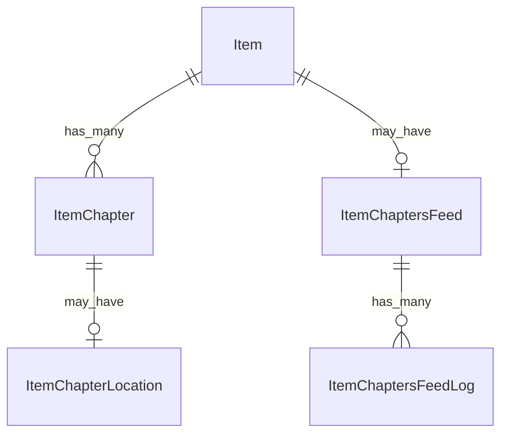

# Fake Data Generator - Item Chapters

## Overview

Item chapter generators create chapter markers and chapter feeds for items.

## Entity Relationships



## Item Chapter Generator

```typescript
// src/faker/generators/item/itemChapter.ts

import { faker } from '@faker-js/faker';
import { DATABASE_CONSTANTS } from 'podverse-helpers';
import { GeneratedItem } from './item';

export interface GeneratedItemChapter {
  id: number;
  item_id: number;
  start_time: string;
  title: string | null;
  img: string | null;
  url: string | null;
  toc: boolean;
}

export interface GeneratedItemChapterLocation {
  id: number;
  item_chapter_id: number;
  geo: string | null;
  osm: string | null;
  name: string | null;
}

export interface GeneratedItemChaptersFeed {
  id: number;
  item_id: number;
  url: string;
  type: string;
}

export interface GeneratedItemChaptersFeedLog {
  id: number;
  item_chapters_feed_id: number;
  last_http_status: number | null;
  last_parse_time: Date | null;
  last_error_message: string | null;
}

export class ItemChapterGenerator {
  private chapterIdCounter = 1;
  private locationIdCounter = 1;
  private feedIdCounter = 1;
  private feedLogIdCounter = 1;
  private mediaServerBase = 'http://localhost:2111';
  
  generate(item: GeneratedItem, duration: number): {
    chapters: GeneratedItemChapter[];
    locations: GeneratedItemChapterLocation[];
    chaptersFeed: GeneratedItemChaptersFeed | null;
    chaptersFeedLog: GeneratedItemChaptersFeedLog | null;
  } {
    // 40% of items have chapters
    if (!faker.datatype.boolean({ probability: 0.4 })) {
      return { chapters: [], locations: [], chaptersFeed: null, chaptersFeedLog: null };
    }
    
    const chapters: GeneratedItemChapter[] = [];
    const locations: GeneratedItemChapterLocation[] = [];
    
    // Generate 3-12 chapters
    const chapterCount = faker.number.int({ min: 3, max: 12 });
    let currentTime = 0;
    const avgChapterLength = duration / chapterCount;
    
    for (let i = 0; i < chapterCount; i++) {
      const chapterId = this.chapterIdCounter++;
      const isLast = i === chapterCount - 1;
      
      chapters.push({
        id: chapterId,
        item_id: item.id,
        start_time: currentTime.toFixed(2),
        title: faker.lorem.sentence({ min: 2, max: 6 }).slice(0, DATABASE_CONSTANTS.varchar_normal),
        img: faker.datatype.boolean({ probability: 0.3 })
          ? `${this.mediaServerBase}/images/chapter-${item.id}-${i}.png`
          : null,
        url: faker.datatype.boolean({ probability: 0.2 })
          ? faker.internet.url().slice(0, DATABASE_CONSTANTS.varchar_url)
          : null,
        toc: true
      });
      
      // 10% of chapters have location
      if (faker.datatype.boolean({ probability: 0.1 })) {
        locations.push({
          id: this.locationIdCounter++,
          item_chapter_id: chapterId,
          geo: `geo:${faker.location.latitude()},${faker.location.longitude()}`.slice(0, DATABASE_CONSTANTS.varchar_normal),
          osm: faker.datatype.boolean({ probability: 0.5 })
            ? `R${faker.number.int({ min: 1000000, max: 9999999 })}`.slice(0, DATABASE_CONSTANTS.varchar_normal)
            : null,
          name: faker.location.city().slice(0, DATABASE_CONSTANTS.varchar_normal)
        });
      }
      
      // Advance time
      const chapterLength = isLast 
        ? duration - currentTime 
        : avgChapterLength * (0.5 + Math.random());
      currentTime += chapterLength;
    }
    
    // Generate chapters feed (for external chapter files)
    const feedId = this.feedIdCounter++;
    const chaptersFeed: GeneratedItemChaptersFeed = {
      id: feedId,
      item_id: item.id,
      url: `${this.mediaServerBase}/chapters/${item.id_text}.json`,
      type: 'application/json+chapters'.slice(0, DATABASE_CONSTANTS.varchar_short)
    };
    
    const chaptersFeedLog: GeneratedItemChaptersFeedLog = {
      id: this.feedLogIdCounter++,
      item_chapters_feed_id: feedId,
      last_http_status: 200,
      last_parse_time: faker.date.recent({ days: 7 }),
      last_error_message: null
    };
    
    return { chapters, locations, chaptersFeed, chaptersFeedLog };
  }
}
```

## Summary

| Entity | Count for baseCount=100 |
|--------|------------------------|
| ItemChapter | ~480 (40% have 3-12 chapters) |
| ItemChapterLocation | ~48 (10% of chapters) |
| ItemChaptersFeed | ~80 (40% of items with chapters) |
| ItemChaptersFeedLog | ~80 (1 per chapters feed) |
