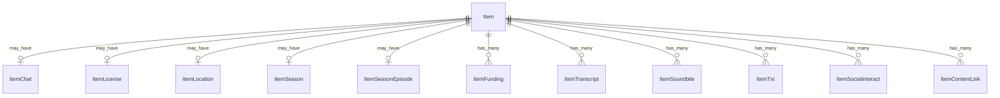

# Fake Data Generator - Item Extras

## Overview

Item extras generators create optional metadata entities like chat, license, location, season, funding, transcripts, soundbites, txt records, social interaction, and content links.

## Entity Relationships



## Item Chat Generator

```typescript
// src/faker/generators/item/itemChat.ts

import { faker } from '@faker-js/faker';
import { DATABASE_CONSTANTS } from 'podverse-helpers';
import { GeneratedItem } from './item';

export interface GeneratedItemChat {
  id: number;
  item_id: number;
  server: string | null;
  protocol: string;
  account_id: string | null;
  space: string | null;
}

export class ItemChatGenerator {
  private idCounter = 1;
  
  generate(item: GeneratedItem): GeneratedItemChat | null {
    if (!faker.datatype.boolean({ probability: 0.05 })) return null;
    
    return {
      id: this.idCounter++,
      item_id: item.id,
      server: `chat.${faker.internet.domainName()}`.slice(0, DATABASE_CONSTANTS.varchar_fqdn),
      protocol: faker.helpers.arrayElement(['irc', 'xmpp', 'matrix']).slice(0, DATABASE_CONSTANTS.varchar_short),
      account_id: faker.string.alphanumeric(20).slice(0, DATABASE_CONSTANTS.varchar_normal),
      space: `#${faker.lorem.word()}-${item.id}`.slice(0, DATABASE_CONSTANTS.varchar_normal)
    };
  }
}
```

## Item License Generator

```typescript
export interface GeneratedItemLicense {
  id: number;
  item_id: number;
  identifier: string;
  url: string | null;
}

export class ItemLicenseGenerator {
  private idCounter = 1;
  private licenses = [
    { identifier: 'CC-BY-4.0', url: 'https://creativecommons.org/licenses/by/4.0/' },
    { identifier: 'CC-BY-SA-4.0', url: 'https://creativecommons.org/licenses/by-sa/4.0/' },
    { identifier: 'CC-BY-NC-4.0', url: 'https://creativecommons.org/licenses/by-nc/4.0/' }
  ];
  
  generate(item: GeneratedItem): GeneratedItemLicense | null {
    if (!faker.datatype.boolean({ probability: 0.1 })) return null;
    
    const license = faker.helpers.arrayElement(this.licenses);
    return {
      id: this.idCounter++,
      item_id: item.id,
      identifier: license.identifier.slice(0, DATABASE_CONSTANTS.varchar_normal),
      url: license.url.slice(0, DATABASE_CONSTANTS.varchar_url)
    };
  }
}
```

## Item Location Generator

```typescript
export interface GeneratedItemLocation {
  id: number;
  item_id: number;
  geo: string | null;
  osm: string | null;
  name: string | null;
}

export class ItemLocationGenerator {
  private idCounter = 1;
  
  generate(item: GeneratedItem): GeneratedItemLocation | null {
    if (!faker.datatype.boolean({ probability: 0.1 })) return null;
    
    return {
      id: this.idCounter++,
      item_id: item.id,
      geo: `geo:${faker.location.latitude()},${faker.location.longitude()}`.slice(0, DATABASE_CONSTANTS.varchar_normal),
      osm: faker.datatype.boolean({ probability: 0.5 })
        ? `R${faker.number.int({ min: 1000000, max: 9999999 })}`.slice(0, DATABASE_CONSTANTS.varchar_normal)
        : null,
      name: faker.location.city().slice(0, DATABASE_CONSTANTS.varchar_normal)
    };
  }
}
```

## Item Season & Episode Generators

```typescript
export interface GeneratedItemSeason {
  id: number;
  item_id: number;
  number: number;
  title: string | null;
}

export class ItemSeasonGenerator {
  private idCounter = 1;
  
  generate(item: GeneratedItem, maxSeason: number = 5): GeneratedItemSeason | null {
    if (!faker.datatype.boolean({ probability: 0.3 })) return null;
    
    return {
      id: this.idCounter++,
      item_id: item.id,
      number: faker.number.int({ min: 1, max: maxSeason }),
      title: faker.datatype.boolean({ probability: 0.4 })
        ? faker.lorem.words({ min: 2, max: 4 }).slice(0, DATABASE_CONSTANTS.varchar_normal)
        : null
    };
  }
}

export interface GeneratedItemSeasonEpisode {
  id: number;
  item_id: number;
  display: string | null;
  number: number;
}

export class ItemSeasonEpisodeGenerator {
  private idCounter = 1;
  
  generate(item: GeneratedItem): GeneratedItemSeasonEpisode | null {
    if (!faker.datatype.boolean({ probability: 0.4 })) return null;
    
    const number = faker.number.int({ min: 1, max: 100 });
    return {
      id: this.idCounter++,
      item_id: item.id,
      display: faker.datatype.boolean({ probability: 0.3 })
        ? `E${number}`.slice(0, DATABASE_CONSTANTS.varchar_short)
        : null,
      number
    };
  }
}
```

## Item Funding Generator

```typescript
export interface GeneratedItemFunding {
  id: number;
  item_id: number;
  url: string;
  title: string | null;
}

export class ItemFundingGenerator {
  private idCounter = 1;
  
  generate(item: GeneratedItem): GeneratedItemFunding[] {
    if (!faker.datatype.boolean({ probability: 0.2 })) return [];
    
    return [{
      id: this.idCounter++,
      item_id: item.id,
      url: (faker.internet.url() + '/support').slice(0, DATABASE_CONSTANTS.varchar_url),
      title: faker.datatype.boolean({ probability: 0.7 })
        ? 'Support this episode'.slice(0, DATABASE_CONSTANTS.varchar_normal)
        : null
    }];
  }
}
```

## Item Transcript Generator

```typescript
export interface GeneratedItemTranscript {
  id: number;
  item_id: number;
  url: string;
  type: string;
  language: string | null;
  rel: string | null;
}

export class ItemTranscriptGenerator {
  private idCounter = 1;
  private mediaServerBase = 'http://localhost:2111';
  
  generate(item: GeneratedItem): GeneratedItemTranscript[] {
    if (!faker.datatype.boolean({ probability: 0.3 })) return [];
    
    const transcripts: GeneratedItemTranscript[] = [];
    const types = [
      { type: 'text/vtt', ext: 'vtt' },
      { type: 'application/srt', ext: 'srt' }
    ];
    
    const count = faker.number.int({ min: 1, max: 2 });
    const selected = faker.helpers.arrayElements(types, count);
    
    for (const t of selected) {
      transcripts.push({
        id: this.idCounter++,
        item_id: item.id,
        url: `${this.mediaServerBase}/transcripts/${item.id_text}.${t.ext}`,
        type: t.type.slice(0, DATABASE_CONSTANTS.varchar_short),
        language: faker.datatype.boolean({ probability: 0.7 })
          ? faker.helpers.arrayElement(['en', 'es', 'de', 'fr'])
          : null,
        rel: faker.datatype.boolean({ probability: 0.2 }) ? 'captions' : null
      });
    }
    
    return transcripts;
  }
}
```

## Item Soundbite Generator

```typescript
export interface GeneratedItemSoundbite {
  id: number;
  item_id: number;
  start_time: string;
  duration: string;
  title: string | null;
}

export class ItemSoundbiteGenerator {
  private idCounter = 1;
  
  generate(item: GeneratedItem, itemDuration: number): GeneratedItemSoundbite[] {
    if (!faker.datatype.boolean({ probability: 0.2 })) return [];
    
    const count = faker.number.int({ min: 1, max: 3 });
    const soundbites: GeneratedItemSoundbite[] = [];
    
    for (let i = 0; i < count; i++) {
      const startTime = faker.number.float({ min: 0, max: itemDuration - 60 });
      const duration = faker.number.float({ min: 15, max: 60 });
      
      soundbites.push({
        id: this.idCounter++,
        item_id: item.id,
        start_time: startTime.toFixed(2),
        duration: duration.toFixed(2),
        title: faker.datatype.boolean({ probability: 0.6 })
          ? faker.lorem.sentence({ min: 2, max: 6 }).slice(0, DATABASE_CONSTANTS.varchar_normal)
          : null
      });
    }
    
    return soundbites;
  }
}
```

## Item Txt, Social Interact, Content Link Generators

```typescript
export interface GeneratedItemTxt {
  id: number;
  item_id: number;
  purpose: string | null;
  value: string;
}

export class ItemTxtGenerator {
  private idCounter = 1;
  
  generate(item: GeneratedItem): GeneratedItemTxt[] {
    if (!faker.datatype.boolean({ probability: 0.05 })) return [];
    
    return [{
      id: this.idCounter++,
      item_id: item.id,
      purpose: faker.helpers.arrayElement(['verify', null]),
      value: faker.string.alphanumeric({ length: { min: 20, max: 50 } }).slice(0, DATABASE_CONSTANTS.varchar_long)
    }];
  }
}

export interface GeneratedItemSocialInteract {
  id: number;
  item_id: number;
  protocol: string;
  uri: string;
  account_id: string | null;
  account_url: string | null;
  priority: number | null;
}

export class ItemSocialInteractGenerator {
  private idCounter = 1;
  
  generate(item: GeneratedItem): GeneratedItemSocialInteract[] {
    if (!faker.datatype.boolean({ probability: 0.15 })) return [];
    
    return [{
      id: this.idCounter++,
      item_id: item.id,
      protocol: faker.helpers.arrayElement(['activitypub', 'twitter']).slice(0, DATABASE_CONSTANTS.varchar_short),
      uri: faker.internet.url().slice(0, DATABASE_CONSTANTS.varchar_uri),
      account_id: faker.internet.username().slice(0, DATABASE_CONSTANTS.varchar_normal),
      account_url: faker.internet.url().slice(0, DATABASE_CONSTANTS.varchar_url),
      priority: 1
    }];
  }
}

export interface GeneratedItemContentLink {
  id: number;
  item_id: number;
  href: string;
  title: string | null;
}

export class ItemContentLinkGenerator {
  private idCounter = 1;
  
  generate(item: GeneratedItem): GeneratedItemContentLink[] {
    if (!faker.datatype.boolean({ probability: 0.2 })) return [];
    
    const count = faker.number.int({ min: 1, max: 3 });
    return Array.from({ length: count }, () => ({
      id: this.idCounter++,
      item_id: item.id,
      href: faker.internet.url().slice(0, DATABASE_CONSTANTS.varchar_url),
      title: faker.lorem.words({ min: 2, max: 5 }).slice(0, DATABASE_CONSTANTS.varchar_normal)
    }));
  }
}
```

## Summary

| Entity | Count for baseCount=100 |
|--------|------------------------|
| ItemChat | ~10 (5% have chat) |
| ItemLicense | ~20 (10% have license) |
| ItemLocation | ~20 (10% have location) |
| ItemSeason | ~60 (30% have season) |
| ItemSeasonEpisode | ~80 (40% have episode) |
| ItemFunding | ~40 (20% have funding) |
| ItemTranscript | ~90 (30% have 1-2) |
| ItemSoundbite | ~60 (20% have 1-3) |
| ItemTxt | ~10 (5% have txt) |
| ItemSocialInteract | ~30 (15% have social) |
| ItemContentLink | ~60 (20% have 1-3) |
