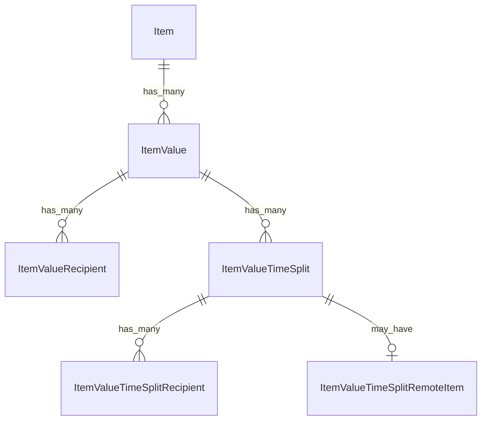

# Fake Data Generator - Item Value

## Overview

Item value generators create Value4Value payment splits with support for time-based splits and remote item references.

## Entity Relationships



## Item Value Generator with Time Splits

```typescript
// src/faker/generators/item/itemValue.ts

import { faker } from '@faker-js/faker';
import { DATABASE_CONSTANTS } from 'podverse-helpers';
import { GeneratedItem } from './item';

export interface GeneratedItemValue {
  id: number;
  item_id: number;
  type: string;
  method: string;
  suggested: number | null;
}

export interface GeneratedItemValueRecipient {
  id: number;
  item_value_id: number;
  type: string;
  address: string;
  split: number;
  name: string | null;
  custom_key: string | null;
  custom_value: string | null;
  fee: boolean;
}

export interface GeneratedItemValueTimeSplit {
  id: number;
  item_value_id: number;
  start_time: string;
  duration: string;
  remote_start_time: string;
  remote_percentage: string;
}

export interface GeneratedItemValueTimeSplitRecipient {
  id: number;
  item_value_time_split_id: number;
  type: string;
  address: string;
  split: number;
  name: string | null;
  custom_key: string | null;
  custom_value: string | null;
  fee: boolean;
}

export interface GeneratedItemValueTimeSplitRemoteItem {
  id: number;
  item_value_time_split_id: number;
  feed_guid: string;
  feed_url: string | null;
  item_guid: string | null;
  title: string | null;
}

export class ItemValueGenerator {
  private valueIdCounter = 1;
  private recipientIdCounter = 1;
  private timeSplitIdCounter = 1;
  private timeSplitRecipientIdCounter = 1;
  private timeSplitRemoteItemIdCounter = 1;
  private mediaServerBase = 'http://localhost:2111';
  
  generate(item: GeneratedItem, itemDuration: number): {
    value: GeneratedItemValue | null;
    recipients: GeneratedItemValueRecipient[];
    timeSplits: GeneratedItemValueTimeSplit[];
    timeSplitRecipients: GeneratedItemValueTimeSplitRecipient[];
    timeSplitRemoteItems: GeneratedItemValueTimeSplitRemoteItem[];
  } {
    // 30% of items have value
    if (!faker.datatype.boolean({ probability: 0.3 })) {
      return { 
        value: null, 
        recipients: [], 
        timeSplits: [], 
        timeSplitRecipients: [], 
        timeSplitRemoteItems: [] 
      };
    }
    
    const valueId = this.valueIdCounter++;
    
    const value: GeneratedItemValue = {
      id: valueId,
      item_id: item.id,
      type: 'lightning',
      method: 'keysend',
      suggested: faker.datatype.boolean({ probability: 0.5 })
        ? faker.number.float({ min: 0.00001, max: 0.001, fractionDigits: 8 })
        : null
    };
    
    // Generate recipients
    const recipients = this.generateRecipients(valueId);
    
    // Generate time splits if channel supports it
    const timeSplits: GeneratedItemValueTimeSplit[] = [];
    const timeSplitRecipients: GeneratedItemValueTimeSplitRecipient[] = [];
    const timeSplitRemoteItems: GeneratedItemValueTimeSplitRemoteItem[] = [];
    
    if (item.channelHasValueTimeSplits && faker.datatype.boolean({ probability: 0.5 })) {
      // Generate 1-3 time splits
      const splitCount = faker.number.int({ min: 1, max: 3 });
      let currentTime = faker.number.float({ min: 0, max: itemDuration / 4 });
      
      for (let i = 0; i < splitCount; i++) {
        const timeSplitId = this.timeSplitIdCounter++;
        const splitDuration = faker.number.float({ min: 30, max: 300 });
        const isRemoteItem = faker.datatype.boolean({ probability: 0.5 });
        
        timeSplits.push({
          id: timeSplitId,
          item_value_id: valueId,
          start_time: currentTime.toFixed(2),
          duration: splitDuration.toFixed(2),
          remote_start_time: isRemoteItem ? faker.number.float({ min: 0, max: 60 }).toFixed(2) : '0.00',
          remote_percentage: isRemoteItem ? faker.number.float({ min: 50, max: 100 }).toFixed(2) : '100.00'
        });
        
        if (isRemoteItem) {
          // Add remote item reference
          timeSplitRemoteItems.push({
            id: this.timeSplitRemoteItemIdCounter++,
            item_value_time_split_id: timeSplitId,
            feed_guid: faker.string.uuid().slice(0, DATABASE_CONSTANTS.varchar_url),
            feed_url: `${this.mediaServerBase}/rss/${faker.number.int({ min: 1, max: 1000 })}.xml`,
            item_guid: faker.string.uuid().slice(0, DATABASE_CONSTANTS.varchar_normal),
            title: null
          });
        } else {
          // Add split recipients
          const splitRecipients = this.generateTimeSplitRecipients(timeSplitId);
          timeSplitRecipients.push(...splitRecipients);
        }
        
        currentTime += splitDuration + faker.number.float({ min: 60, max: itemDuration / 4 });
        if (currentTime > itemDuration) break;
      }
    }
    
    return { value, recipients, timeSplits, timeSplitRecipients, timeSplitRemoteItems };
  }
  
  private generateRecipients(valueId: number): GeneratedItemValueRecipient[] {
    const recipients: GeneratedItemValueRecipient[] = [];
    const count = faker.number.int({ min: 2, max: 5 });
    let remainingSplit = 100;
    
    for (let i = 0; i < count; i++) {
      const isLast = i === count - 1;
      const split = isLast 
        ? remainingSplit 
        : faker.number.int({ min: 5, max: Math.min(50, remainingSplit - (count - i - 1) * 5) });
      
      remainingSplit -= split;
      
      recipients.push({
        id: this.recipientIdCounter++,
        item_value_id: valueId,
        type: 'node',
        address: faker.string.hexadecimal({ length: 66, casing: 'lower' }).slice(2),
        split,
        name: faker.datatype.boolean({ probability: 0.7 })
          ? faker.person.fullName().slice(0, DATABASE_CONSTANTS.varchar_normal)
          : null,
        custom_key: faker.datatype.boolean({ probability: 0.2 })
          ? faker.string.numeric(8)
          : null,
        custom_value: faker.datatype.boolean({ probability: 0.2 })
          ? faker.string.alphanumeric(20)
          : null,
        fee: i === 0 && faker.datatype.boolean({ probability: 0.2 })
      });
    }
    
    return recipients;
  }
  
  private generateTimeSplitRecipients(timeSplitId: number): GeneratedItemValueTimeSplitRecipient[] {
    const recipients: GeneratedItemValueTimeSplitRecipient[] = [];
    const count = faker.number.int({ min: 1, max: 3 });
    let remainingSplit = 100;
    
    for (let i = 0; i < count; i++) {
      const isLast = i === count - 1;
      const split = isLast 
        ? remainingSplit 
        : faker.number.int({ min: 20, max: Math.min(60, remainingSplit - (count - i - 1) * 20) });
      
      remainingSplit -= split;
      
      recipients.push({
        id: this.timeSplitRecipientIdCounter++,
        item_value_time_split_id: timeSplitId,
        type: 'node',
        address: faker.string.hexadecimal({ length: 66, casing: 'lower' }).slice(2),
        split,
        name: faker.datatype.boolean({ probability: 0.6 })
          ? faker.person.fullName().slice(0, DATABASE_CONSTANTS.varchar_normal)
          : null,
        custom_key: null,
        custom_value: null,
        fee: false
      });
    }
    
    return recipients;
  }
}
```

## Summary

| Entity | Count for baseCount=100 |
|--------|------------------------|
| ItemValue | ~60 (30% have value) |
| ItemValueRecipient | ~180 (2-5 per value) |
| ItemValueTimeSplit | ~45 (50% of value items have 1-3) |
| ItemValueTimeSplitRecipient | ~45 (1-3 per non-remote split) |
| ItemValueTimeSplitRemoteItem | ~22 (50% of splits are remote) |
