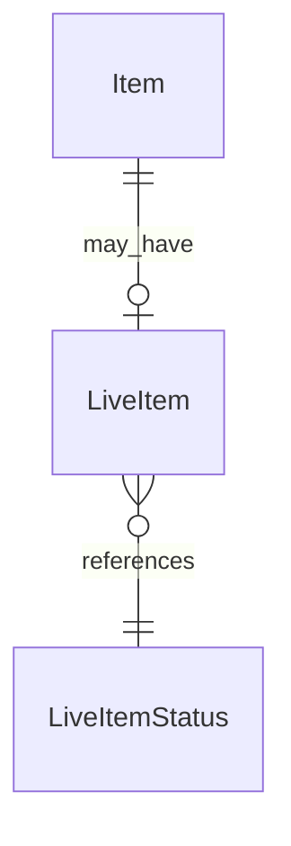

# Fake Data Generator - Live Item

## Overview

Live Item generator creates live streaming metadata for items. About 10% of items are live items.

## Entity Relationships



## Live Item Generator

```typescript
// src/faker/generators/item/liveItem.ts

import { faker } from '@faker-js/faker';
import { LiveItemStatusEnum } from 'podverse-orm';
import { GeneratedItem } from './item';

export interface GeneratedLiveItem {
  id: number;
  item_id: number;
  live_item_status_id: number;
  start_time: Date;
  end_time: Date | null;
  chat_web_url: string | null;
}

export class LiveItemGenerator {
  private idCounter = 1;
  
  generate(item: GeneratedItem): GeneratedLiveItem | null {
    // 10% of items are live items
    if (!faker.datatype.boolean({ probability: 0.1 })) return null;
    
    const status = faker.helpers.arrayElement([
      LiveItemStatusEnum.Pending,
      LiveItemStatusEnum.Live,
      LiveItemStatusEnum.Ended
    ]);
    
    const startTime = status === LiveItemStatusEnum.Pending
      ? faker.date.future({ years: 0.1 })
      : faker.date.recent({ days: 30 });
    
    let endTime: Date | null = null;
    if (status === LiveItemStatusEnum.Ended) {
      endTime = new Date(startTime);
      endTime.setHours(endTime.getHours() + faker.number.int({ min: 1, max: 4 }));
    }
    
    return {
      id: this.idCounter++,
      item_id: item.id,
      live_item_status_id: status,
      start_time: startTime,
      end_time: endTime,
      chat_web_url: faker.datatype.boolean({ probability: 0.5 })
        ? faker.internet.url()
        : null
    };
  }
}
```

## Live Item Statuses

| Status | ID | Description |
|--------|-----|-------------|
| Pending | 1 | Scheduled for future |
| Live | 2 | Currently streaming |
| Ended | 3 | Stream completed |

## Summary

| Entity | Count for baseCount=100 |
|--------|------------------------|
| LiveItem | ~20 (10% of items) |
