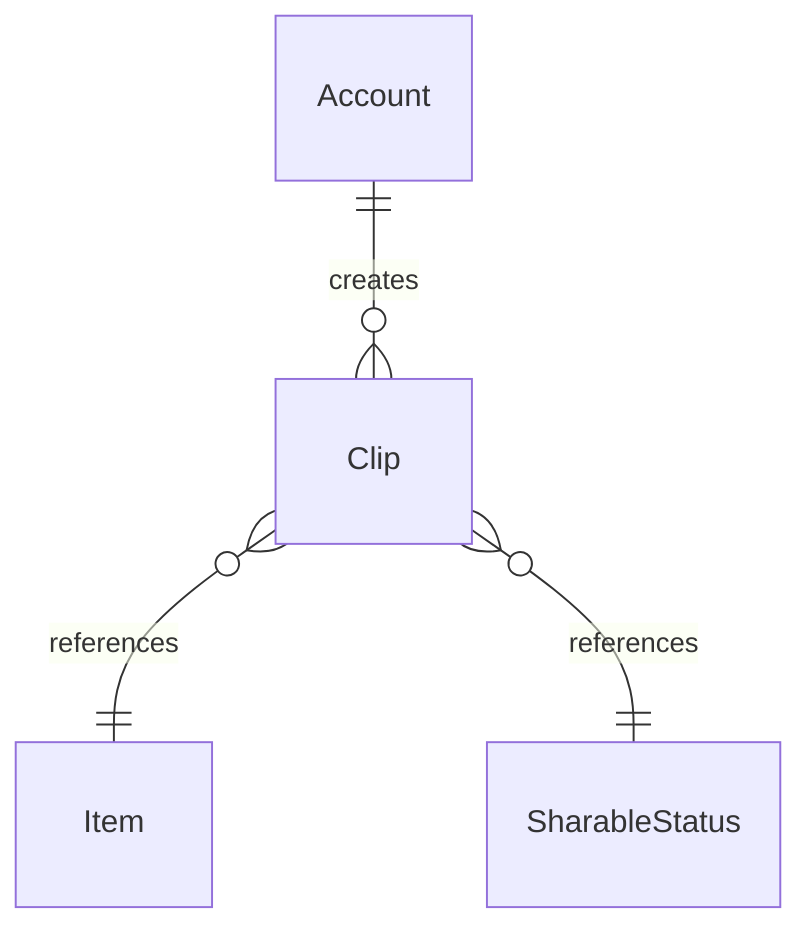

# Fake Data Generator - Clips

## Overview

Clip generator creates user-generated audio/video clips from items.

## Entity Relationships



## Clip Generator

```typescript
// src/faker/generators/userContent/clip.ts

import { faker } from '@faker-js/faker';
import { generateRandomIdText } from 'podverse-orm';
import { DATABASE_CONSTANTS, SharableStatusEnum } from 'podverse-helpers';
import { GeneratedAccount } from '../account/account';
import { GeneratedItem } from '../item/item';

export interface GeneratedClip {
  id: number;
  id_text: string;
  account_id: number;
  item_id: number;
  start_time: string;
  end_time: string | null;
  title: string | null;
  description: string | null;
  created_at: Date;
  sharable_status_id: number;
}

export class ClipGenerator {
  private idCounter = 1;
  
  generate(
    accounts: GeneratedAccount[],
    items: GeneratedItem[],
    count: number
  ): GeneratedClip[] {
    const clips: GeneratedClip[] = [];
    
    for (let i = 0; i < count; i++) {
      const account = faker.helpers.arrayElement(accounts);
      const item = faker.helpers.arrayElement(items);
      
      // Generate start/end times within a reasonable duration
      const startTime = faker.number.float({ min: 0, max: 3000 });
      const hasEndTime = faker.datatype.boolean({ probability: 0.7 });
      const endTime = hasEndTime 
        ? startTime + faker.number.float({ min: 10, max: 300 })
        : null;
      
      clips.push({
        id: this.idCounter++,
        id_text: generateRandomIdText(),
        account_id: account.id,
        item_id: item.id,
        start_time: startTime.toFixed(2),
        end_time: endTime?.toFixed(2) || null,
        title: faker.datatype.boolean({ probability: 0.8 })
          ? faker.lorem.sentence({ min: 2, max: 8 }).slice(0, DATABASE_CONSTANTS.varchar_normal)
          : null,
        description: faker.datatype.boolean({ probability: 0.4 })
          ? faker.lorem.paragraph().slice(0, DATABASE_CONSTANTS.varchar_long)
          : null,
        created_at: faker.date.past({ years: 2 }),
        sharable_status_id: faker.helpers.weightedArrayElement([
          { value: SharableStatusEnum.Public, weight: 6 },
          { value: SharableStatusEnum.Unlisted, weight: 3 },
          { value: SharableStatusEnum.Private, weight: 1 }
        ])
      });
    }
    
    return clips;
  }
  
  toSQL(clip: GeneratedClip): string {
    const endTime = clip.end_time ? `'${clip.end_time}'` : 'NULL';
    const title = clip.title ? `'${this.escapeSQL(clip.title)}'` : 'NULL';
    const description = clip.description ? `'${this.escapeSQL(clip.description)}'` : 'NULL';
    
    return `INSERT INTO clip (id, id_text, account_id, item_id, start_time, end_time, title, description, created_at, sharable_status_id) VALUES (${clip.id}, '${clip.id_text}', ${clip.account_id}, ${clip.item_id}, '${clip.start_time}', ${endTime}, ${title}, ${description}, '${clip.created_at.toISOString()}', ${clip.sharable_status_id});`;
  }
  
  private escapeSQL(str: string): string {
    return str.replace(/'/g, "''");
  }
}
```

## Summary

| Entity | Count for baseCount=100 |
|--------|------------------------|
| Clip | 100 |
