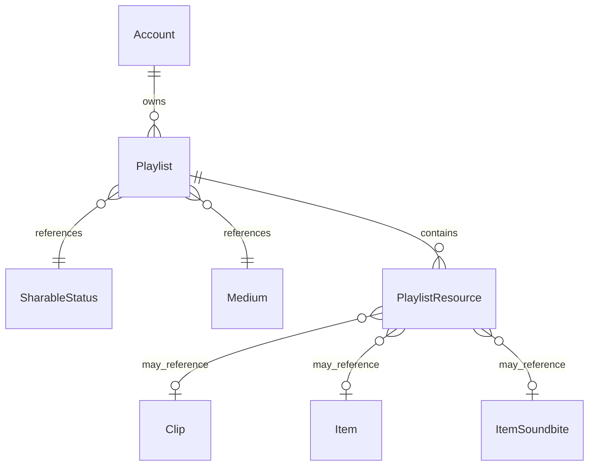

# Fake Data Generator - Playlists

## Overview

Playlist generators create user playlists and their resources (clips, items, soundbites).

> **⚠️ Note:** The `add_by_rss_hash_id` and `add_by_rss_resource_data` fields in `PlaylistResource` are **excluded** from this initial implementation. These JSON-based fields will be implemented separately after all other faker work is complete. See [00-index.md](./00-index.md#excluded-features-deferred) for details.

## Entity Relationships



## Playlist Generator

```typescript
// src/faker/generators/userContent/playlist.ts

import { faker } from '@faker-js/faker';
import { generateRandomIdText } from 'podverse-orm';
import { DATABASE_CONSTANTS, SharableStatusEnum, MediumEnum } from 'podverse-helpers';
import { GeneratedAccount } from '../account/account';

export interface GeneratedPlaylist {
  id: number;
  id_text: string;
  account_id: number;
  sharable_status_id: number;
  title: string | null;
  description: string | null;
  is_default_favorites: boolean;
  item_count: number;
  last_updated: Date;
  medium_id: number;
}

export class PlaylistGenerator {
  private idCounter = 1;
  private defaultFavoritesCreated: Set<string> = new Set(); // account_id-medium_id
  
  generate(accounts: GeneratedAccount[], count: number): GeneratedPlaylist[] {
    const playlists: GeneratedPlaylist[] = [];
    
    // First, create default favorites playlists for each account (one per medium)
    for (const account of accounts) {
      // Default favorites for AV medium (main supported playlist medium)
      const key = `${account.id}-${MediumEnum.AV}`;
      if (!this.defaultFavoritesCreated.has(key)) {
        playlists.push({
          id: this.idCounter++,
          id_text: generateRandomIdText(),
          account_id: account.id,
          sharable_status_id: SharableStatusEnum.Private,
          title: null, // Default favorites has no title
          description: null,
          is_default_favorites: true,
          item_count: 0, // Will be updated when resources are added
          last_updated: faker.date.past({ years: 1 }),
          medium_id: MediumEnum.AV
        });
        this.defaultFavoritesCreated.add(key);
      }
    }
    
    // Then create additional regular playlists
    for (let i = 0; i < count; i++) {
      const account = faker.helpers.arrayElement(accounts);
      
      playlists.push({
        id: this.idCounter++,
        id_text: generateRandomIdText(),
        account_id: account.id,
        sharable_status_id: faker.helpers.weightedArrayElement([
          { value: SharableStatusEnum.Public, weight: 4 },
          { value: SharableStatusEnum.Unlisted, weight: 4 },
          { value: SharableStatusEnum.Private, weight: 2 }
        ]),
        title: faker.lorem.words({ min: 2, max: 5 }).slice(0, DATABASE_CONSTANTS.varchar_normal),
        description: faker.datatype.boolean({ probability: 0.5 })
          ? faker.lorem.paragraph().slice(0, DATABASE_CONSTANTS.varchar_long)
          : null,
        is_default_favorites: false,
        item_count: 0, // Will be updated
        last_updated: faker.date.past({ years: 1 }),
        medium_id: MediumEnum.AV // Playlists use AV medium
      });
    }
    
    return playlists;
  }
}
```

## Playlist Resource Generator

```typescript
// src/faker/generators/userContent/playlistResource.ts

import { faker } from '@faker-js/faker';
import { GeneratedPlaylist } from './playlist';
import { GeneratedClip } from './clip';
import { GeneratedItem } from '../item/item';

export interface GeneratedPlaylistResource {
  id: number;
  playlist_id: number;
  list_position: string;
  clip_id: number | null;
  item_id: number | null;
  item_soundbite_id: number | null;
  // NOTE: add_by_rss_* fields are EXCLUDED from initial implementation
  // These will always be null - separate phase will handle add-by-rss data
  add_by_rss_hash_id: null;
  add_by_rss_resource_data: null;
}

export class PlaylistResourceGenerator {
  private idCounter = 1;
  
  generate(
    playlists: GeneratedPlaylist[],
    clips: GeneratedClip[],
    items: GeneratedItem[],
    soundbiteIds: number[]
  ): GeneratedPlaylistResource[] {
    const resources: GeneratedPlaylistResource[] = [];
    
    for (const playlist of playlists) {
      // Skip default favorites playlists for now, or add minimal items
      if (playlist.is_default_favorites) {
        // Add 0-3 items to favorites
        const itemCount = faker.number.int({ min: 0, max: 3 });
        for (let i = 0; i < itemCount; i++) {
          const item = faker.helpers.arrayElement(items);
          resources.push({
            id: this.idCounter++,
            playlist_id: playlist.id,
            list_position: (i + 1).toString(),
            clip_id: null,
            item_id: item.id,
            item_soundbite_id: null,
            add_by_rss_hash_id: null,
            add_by_rss_resource_data: null
          });
        }
        continue;
      }
      
      // Add 2-10 resources to regular playlists
      const resourceCount = faker.number.int({ min: 2, max: 10 });
      
      for (let i = 0; i < resourceCount; i++) {
        // Decide resource type: 50% items, 30% clips, 20% soundbites
        const resourceType = faker.helpers.weightedArrayElement([
          { value: 'item', weight: 5 },
          { value: 'clip', weight: 3 },
          { value: 'soundbite', weight: 2 }
        ]);
        
        let clipId: number | null = null;
        let itemId: number | null = null;
        let soundbiteId: number | null = null;
        
        if (resourceType === 'clip' && clips.length > 0) {
          clipId = faker.helpers.arrayElement(clips).id;
        } else if (resourceType === 'soundbite' && soundbiteIds.length > 0) {
          soundbiteId = faker.helpers.arrayElement(soundbiteIds);
        } else {
          itemId = faker.helpers.arrayElement(items).id;
        }
        
        resources.push({
          id: this.idCounter++,
          playlist_id: playlist.id,
          list_position: (i + 1).toString(),
          clip_id: clipId,
          item_id: itemId,
          item_soundbite_id: soundbiteId,
          add_by_rss_hash_id: null,
          add_by_rss_resource_data: null
        });
      }
    }
    
    return resources;
  }
}
```

## Summary

| Entity | Count for baseCount=100 |
|--------|------------------------|
| Playlist | ~204 (104 default favorites + 100 regular) |
| PlaylistResource | ~812 (0-3 per favorites, 2-10 per regular) |
