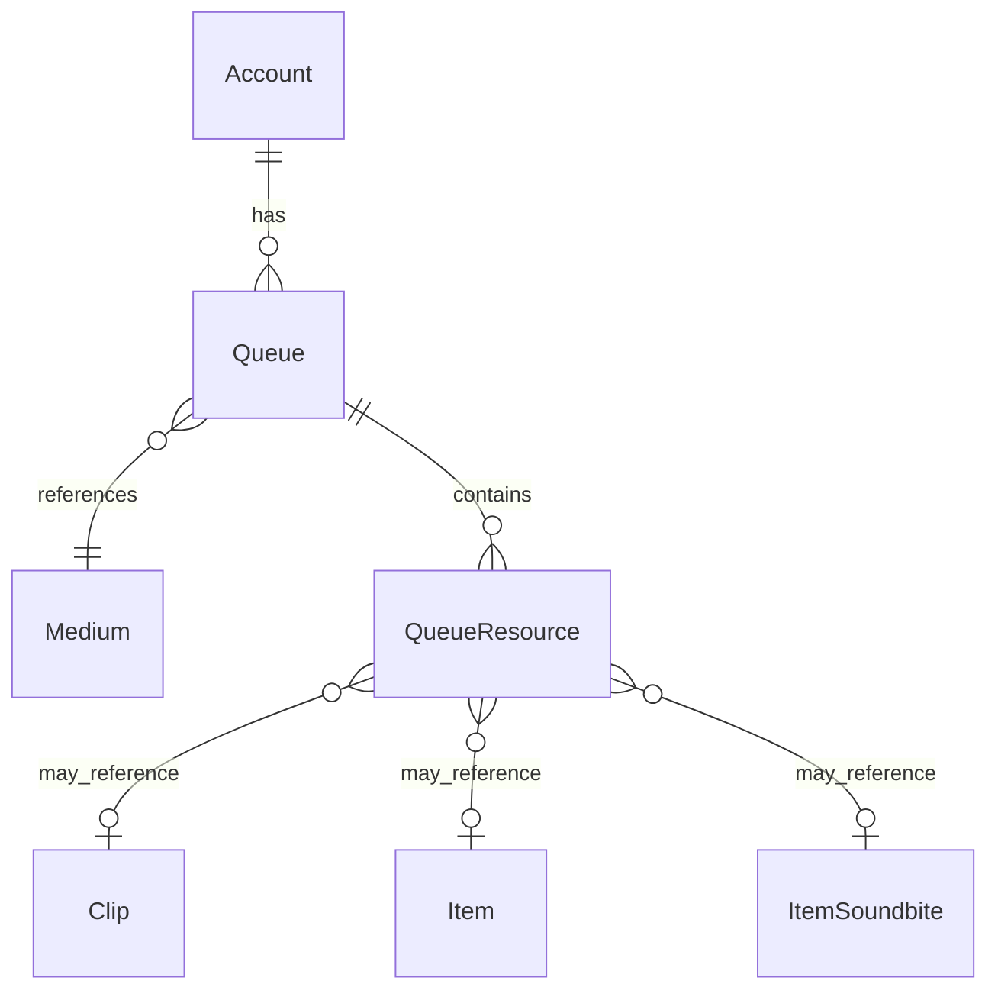

# Fake Data Generator - Queues

## Overview

Queue generators create playback queues for accounts, one per supported medium type.

> **⚠️ Note:** The `add_by_rss_hash_id` and `add_by_rss_resource_data` fields in `QueueResource` are **excluded** from this initial implementation. These JSON-based fields will be implemented separately after all other faker work is complete. See [00-index.md](./00-index.md#excluded-features-deferred) for details.

## Entity Relationships



## Queue Generator

```typescript
// src/faker/generators/userContent/queue.ts

import { faker } from '@faker-js/faker';
import { generateRandomIdText } from 'podverse-orm';
import { MediumEnum } from 'podverse-helpers';
import { GeneratedAccount } from '../account/account';

export interface GeneratedQueue {
  id: number;
  id_text: string;
  account_id: number;
  medium_id: number;
  is_active_queue: boolean;
}

export class QueueGenerator {
  private idCounter = 1;
  private activeQueuesCreated: Map<number, Set<number>> = new Map(); // account_id -> Set<medium_id>
  
  generate(accounts: GeneratedAccount[]): GeneratedQueue[] {
    const queues: GeneratedQueue[] = [];
    const supportedMediums = [MediumEnum.Podcast, MediumEnum.Video, MediumEnum.Music, MediumEnum.AV];
    
    for (const account of accounts) {
      // Each account gets one queue per supported medium
      for (const mediumId of supportedMediums) {
        // Check if this is the active queue for this account/medium
        let isActive = false;
        if (!this.activeQueuesCreated.has(account.id)) {
          this.activeQueuesCreated.set(account.id, new Set());
        }
        
        const accountActiveQueues = this.activeQueuesCreated.get(account.id)!;
        if (!accountActiveQueues.has(mediumId)) {
          isActive = true;
          accountActiveQueues.add(mediumId);
        }
        
        queues.push({
          id: this.idCounter++,
          id_text: generateRandomIdText(),
          account_id: account.id,
          medium_id: mediumId,
          is_active_queue: isActive
        });
      }
    }
    
    return queues;
  }
}
```

## Queue Resource Generator

```typescript
// src/faker/generators/userContent/queueResource.ts

import { faker } from '@faker-js/faker';
import { GeneratedQueue } from './queue';
import { GeneratedClip } from './clip';
import { GeneratedItem } from '../item/item';

export interface GeneratedQueueResource {
  id: number;
  queue_id: number;
  list_position: string;
  playback_position: string;
  media_file_duration: string;
  completed: boolean;
  clip_id: number | null;
  item_id: number | null;
  item_soundbite_id: number | null;
  // NOTE: add_by_rss_* fields are EXCLUDED from initial implementation
  // These will always be null - separate phase will handle add-by-rss data
  add_by_rss_hash_id: null;
  add_by_rss_resource_data: null;
}

export class QueueResourceGenerator {
  private idCounter = 1;
  
  generate(
    queues: GeneratedQueue[],
    clips: GeneratedClip[],
    items: GeneratedItem[],
    soundbiteIds: number[]
  ): GeneratedQueueResource[] {
    const resources: GeneratedQueueResource[] = [];
    
    for (const queue of queues) {
      // Each queue has 0-15 items
      const resourceCount = faker.number.int({ min: 0, max: 15 });
      
      for (let i = 0; i < resourceCount; i++) {
        // Mostly items in queue, occasionally clips
        const isClip = clips.length > 0 && faker.datatype.boolean({ probability: 0.1 });
        
        const duration = faker.number.float({ min: 300, max: 7200 });
        const playbackPosition = faker.number.float({ min: 0, max: duration });
        const completed = playbackPosition >= duration * 0.95;
        
        resources.push({
          id: this.idCounter++,
          queue_id: queue.id,
          list_position: (i + 1).toString(),
          playback_position: playbackPosition.toFixed(2),
          media_file_duration: duration.toFixed(2),
          completed,
          clip_id: isClip ? faker.helpers.arrayElement(clips).id : null,
          item_id: !isClip ? faker.helpers.arrayElement(items).id : null,
          item_soundbite_id: null,
          add_by_rss_hash_id: null,
          add_by_rss_resource_data: null
        });
      }
    }
    
    return resources;
  }
}
```

## Summary

| Entity | Count for baseCount=100 |
|--------|------------------------|
| Queue | ~416 (4 per account × 104 accounts) |
| QueueResource | ~3120 (0-15 per queue) |
