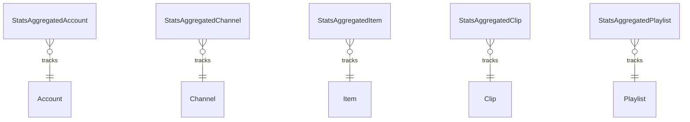

# Fake Data Generator - Stats Aggregated

## Overview

Stats aggregated generators create time-bucketed analytics data for accounts, channels, items, clips, and playlists.

## Entity Relationships



## Stats Aggregated Generator

```typescript
// src/faker/generators/stats/statsAggregated.ts

import { faker } from '@faker-js/faker';
import { GeneratedAccount } from '../account/account';
import { GeneratedChannel } from '../channel/channel';
import { GeneratedItem } from '../item/item';
import { GeneratedClip } from '../userContent/clip';
import { GeneratedPlaylist } from '../userContent/playlist';

interface BaseStatsAggregated {
  id: number;
  day_current_count: number;
  day_1_count: number;
  day_2_count: number;
  day_3_count: number;
  day_4_count: number;
  day_5_count: number;
  day_6_count: number;
  day_7_count: number;
  day_8_count: number;
  week_current_count: number;
  week_1_count: number;
  week_2_count: number;
  week_3_count: number;
  week_4_count: number;
  month_current_count: number;
  month_1_count: number;
  all_time_count: number;
}

export interface GeneratedStatsAggregatedAccount extends BaseStatsAggregated {
  account_id: number;
}

export interface GeneratedStatsAggregatedChannel extends BaseStatsAggregated {
  channel_id: number;
}

export interface GeneratedStatsAggregatedItem extends BaseStatsAggregated {
  item_id: number;
}

export interface GeneratedStatsAggregatedClip extends BaseStatsAggregated {
  clip_id: number;
}

export interface GeneratedStatsAggregatedPlaylist extends BaseStatsAggregated {
  playlist_id: number;
}

export class StatsAggregatedGenerator {
  private accountIdCounter = 1;
  private channelIdCounter = 1;
  private itemIdCounter = 1;
  private clipIdCounter = 1;
  private playlistIdCounter = 1;
  
  private generateBaseStats(): Omit<BaseStatsAggregated, 'id'> {
    // Generate realistic decreasing counts going back in time
    const baseDailyCount = faker.number.int({ min: 0, max: 100 });
    
    return {
      day_current_count: Math.floor(baseDailyCount * faker.number.float({ min: 0.8, max: 1.2 })),
      day_1_count: Math.floor(baseDailyCount * faker.number.float({ min: 0.7, max: 1.1 })),
      day_2_count: Math.floor(baseDailyCount * faker.number.float({ min: 0.6, max: 1.0 })),
      day_3_count: Math.floor(baseDailyCount * faker.number.float({ min: 0.5, max: 0.9 })),
      day_4_count: Math.floor(baseDailyCount * faker.number.float({ min: 0.4, max: 0.8 })),
      day_5_count: Math.floor(baseDailyCount * faker.number.float({ min: 0.3, max: 0.7 })),
      day_6_count: Math.floor(baseDailyCount * faker.number.float({ min: 0.2, max: 0.6 })),
      day_7_count: Math.floor(baseDailyCount * faker.number.float({ min: 0.1, max: 0.5 })),
      day_8_count: Math.floor(baseDailyCount * faker.number.float({ min: 0.1, max: 0.4 })),
      week_current_count: Math.floor(baseDailyCount * 7 * faker.number.float({ min: 0.8, max: 1.2 })),
      week_1_count: Math.floor(baseDailyCount * 7 * faker.number.float({ min: 0.6, max: 1.0 })),
      week_2_count: Math.floor(baseDailyCount * 7 * faker.number.float({ min: 0.4, max: 0.8 })),
      week_3_count: Math.floor(baseDailyCount * 7 * faker.number.float({ min: 0.3, max: 0.7 })),
      week_4_count: Math.floor(baseDailyCount * 7 * faker.number.float({ min: 0.2, max: 0.6 })),
      month_current_count: Math.floor(baseDailyCount * 30 * faker.number.float({ min: 0.8, max: 1.2 })),
      month_1_count: Math.floor(baseDailyCount * 30 * faker.number.float({ min: 0.5, max: 0.9 })),
      all_time_count: Math.floor(baseDailyCount * 365 * faker.number.float({ min: 1, max: 3 }))
    };
  }
  
  generateForAccounts(accounts: GeneratedAccount[]): GeneratedStatsAggregatedAccount[] {
    return accounts.map(account => ({
      id: this.accountIdCounter++,
      account_id: account.id,
      ...this.generateBaseStats()
    }));
  }
  
  generateForChannels(channels: GeneratedChannel[]): GeneratedStatsAggregatedChannel[] {
    return channels.map(channel => ({
      id: this.channelIdCounter++,
      channel_id: channel.id,
      ...this.generateBaseStats()
    }));
  }
  
  generateForItems(items: GeneratedItem[]): GeneratedStatsAggregatedItem[] {
    return items.map(item => ({
      id: this.itemIdCounter++,
      item_id: item.id,
      ...this.generateBaseStats()
    }));
  }
  
  generateForClips(clips: GeneratedClip[]): GeneratedStatsAggregatedClip[] {
    return clips.map(clip => ({
      id: this.clipIdCounter++,
      clip_id: clip.id,
      ...this.generateBaseStats()
    }));
  }
  
  generateForPlaylists(playlists: GeneratedPlaylist[]): GeneratedStatsAggregatedPlaylist[] {
    return playlists.map(playlist => ({
      id: this.playlistIdCounter++,
      playlist_id: playlist.id,
      ...this.generateBaseStats()
    }));
  }
}
```

## Time Buckets

| Field | Description |
|-------|-------------|
| day_current_count | Today's count |
| day_1_count through day_8_count | Previous 8 days |
| week_current_count | Current week |
| week_1_count through week_4_count | Previous 4 weeks |
| month_current_count | Current month |
| month_1_count | Previous month |
| all_time_count | Total all time |

## Summary

| Entity | Count for baseCount=100 |
|--------|------------------------|
| StatsAggregatedAccount | 104 (1 per account) |
| StatsAggregatedChannel | 100 (1 per channel) |
| StatsAggregatedItem | 200 (1 per item) |
| StatsAggregatedClip | 100 (1 per clip) |
| StatsAggregatedPlaylist | ~204 (1 per playlist) |
