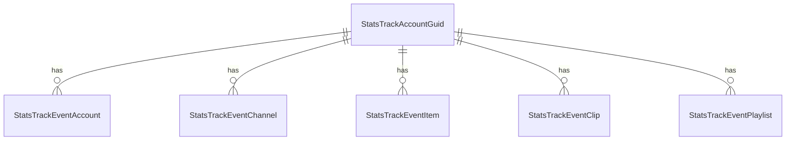

# Fake Data Generator - Stats Track Events

## Overview

Stats track event generators create granular analytics events for tracking user interactions.

## Entity Relationships



## Stats Track Event Generator

```typescript
// src/faker/generators/stats/statsTrackEvent.ts

import { faker } from '@faker-js/faker';
import { GeneratedAccount } from '../account/account';
import { GeneratedChannel } from '../channel/channel';
import { GeneratedItem } from '../item/item';
import { GeneratedClip } from '../userContent/clip';
import { GeneratedPlaylist } from '../userContent/playlist';

export interface GeneratedStatsTrackAccountGuid {
  id: number;
  account_guid: string;
  account_id: number | null;
}

export interface GeneratedStatsTrackEventAccount {
  id: number;
  account_guid: string;
  account_id: number;
  created_at: Date;
}

export interface GeneratedStatsTrackEventChannel {
  id: number;
  account_guid: string;
  channel_id: number;
  created_at: Date;
}

export interface GeneratedStatsTrackEventItem {
  id: number;
  account_guid: string;
  item_id: number;
  created_at: Date;
}

export interface GeneratedStatsTrackEventClip {
  id: number;
  account_guid: string;
  clip_id: number;
  created_at: Date;
}

export interface GeneratedStatsTrackEventPlaylist {
  id: number;
  account_guid: string;
  playlist_id: number;
  created_at: Date;
}

export class StatsTrackEventGenerator {
  private accountGuidIdCounter = 1;
  private eventAccountIdCounter = 1;
  private eventChannelIdCounter = 1;
  private eventItemIdCounter = 1;
  private eventClipIdCounter = 1;
  private eventPlaylistIdCounter = 1;
  
  generateAccountGuids(
    accounts: GeneratedAccount[],
    anonymousCount: number = 50
  ): GeneratedStatsTrackAccountGuid[] {
    const guids: GeneratedStatsTrackAccountGuid[] = [];
    
    // Create guids for logged-in accounts
    for (const account of accounts) {
      guids.push({
        id: this.accountGuidIdCounter++,
        account_guid: faker.string.uuid(),
        account_id: account.id
      });
    }
    
    // Create anonymous guids
    for (let i = 0; i < anonymousCount; i++) {
      guids.push({
        id: this.accountGuidIdCounter++,
        account_guid: faker.string.uuid(),
        account_id: null
      });
    }
    
    return guids;
  }
  
  generateEventAccounts(
    accountGuids: GeneratedStatsTrackAccountGuid[],
    accounts: GeneratedAccount[]
  ): GeneratedStatsTrackEventAccount[] {
    const events: GeneratedStatsTrackEventAccount[] = [];
    
    // Generate random events
    const eventCount = accounts.length * 5;
    
    for (let i = 0; i < eventCount; i++) {
      const guid = faker.helpers.arrayElement(accountGuids);
      const account = faker.helpers.arrayElement(accounts);
      
      events.push({
        id: this.eventAccountIdCounter++,
        account_guid: guid.account_guid,
        account_id: account.id,
        created_at: faker.date.past({ years: 1 })
      });
    }
    
    return events;
  }
  
  generateEventChannels(
    accountGuids: GeneratedStatsTrackAccountGuid[],
    channels: GeneratedChannel[]
  ): GeneratedStatsTrackEventChannel[] {
    const events: GeneratedStatsTrackEventChannel[] = [];
    const eventCount = channels.length * 10;
    
    for (let i = 0; i < eventCount; i++) {
      const guid = faker.helpers.arrayElement(accountGuids);
      const channel = faker.helpers.arrayElement(channels);
      
      events.push({
        id: this.eventChannelIdCounter++,
        account_guid: guid.account_guid,
        channel_id: channel.id,
        created_at: faker.date.past({ years: 1 })
      });
    }
    
    return events;
  }
  
  generateEventItems(
    accountGuids: GeneratedStatsTrackAccountGuid[],
    items: GeneratedItem[]
  ): GeneratedStatsTrackEventItem[] {
    const events: GeneratedStatsTrackEventItem[] = [];
    const eventCount = items.length * 5;
    
    for (let i = 0; i < eventCount; i++) {
      const guid = faker.helpers.arrayElement(accountGuids);
      const item = faker.helpers.arrayElement(items);
      
      events.push({
        id: this.eventItemIdCounter++,
        account_guid: guid.account_guid,
        item_id: item.id,
        created_at: faker.date.past({ years: 1 })
      });
    }
    
    return events;
  }
  
  generateEventClips(
    accountGuids: GeneratedStatsTrackAccountGuid[],
    clips: GeneratedClip[]
  ): GeneratedStatsTrackEventClip[] {
    const events: GeneratedStatsTrackEventClip[] = [];
    const eventCount = clips.length * 3;
    
    for (let i = 0; i < eventCount; i++) {
      const guid = faker.helpers.arrayElement(accountGuids);
      const clip = faker.helpers.arrayElement(clips);
      
      events.push({
        id: this.eventClipIdCounter++,
        account_guid: guid.account_guid,
        clip_id: clip.id,
        created_at: faker.date.past({ years: 1 })
      });
    }
    
    return events;
  }
  
  generateEventPlaylists(
    accountGuids: GeneratedStatsTrackAccountGuid[],
    playlists: GeneratedPlaylist[]
  ): GeneratedStatsTrackEventPlaylist[] {
    const events: GeneratedStatsTrackEventPlaylist[] = [];
    const eventCount = playlists.length * 2;
    
    for (let i = 0; i < eventCount; i++) {
      const guid = faker.helpers.arrayElement(accountGuids);
      const playlist = faker.helpers.arrayElement(playlists);
      
      events.push({
        id: this.eventPlaylistIdCounter++,
        account_guid: guid.account_guid,
        playlist_id: playlist.id,
        created_at: faker.date.past({ years: 1 })
      });
    }
    
    return events;
  }
}
```

## Summary

| Entity | Count for baseCount=100 |
|--------|------------------------|
| StatsTrackAccountGuid | ~154 (104 accounts + 50 anonymous) |
| StatsTrackEventAccount | ~520 (5 per account) |
| StatsTrackEventChannel | ~1000 (10 per channel) |
| StatsTrackEventItem | ~1000 (5 per item) |
| StatsTrackEventClip | ~300 (3 per clip) |
| StatsTrackEventPlaylist | ~408 (2 per playlist) |
