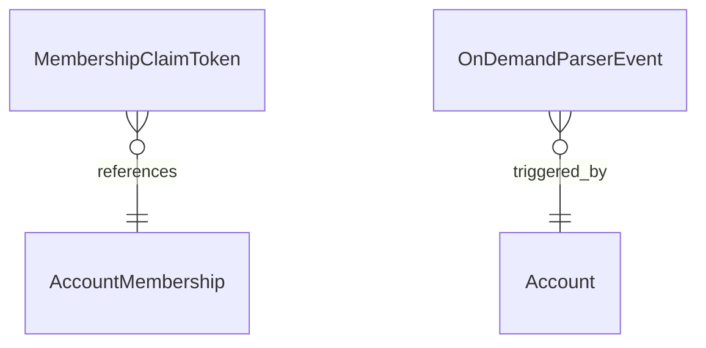

# Fake Data Generator - Miscellaneous

## Overview

Miscellaneous generators create membership claim tokens and on-demand parser events.

## Entity Relationships



## Membership Claim Token Generator

```typescript
// src/faker/generators/misc/membershipClaimToken.ts

import { faker } from '@faker-js/faker';
import { AccountMembershipEnum } from 'podverse-helpers';

export interface GeneratedMembershipClaimToken {
  id: string; // UUID
  claimed: boolean;
  months_to_add: number;
  account_membership_id: number;
}

export class MembershipClaimTokenGenerator {
  generate(count: number): GeneratedMembershipClaimToken[] {
    const tokens: GeneratedMembershipClaimToken[] = [];
    
    for (let i = 0; i < count; i++) {
      tokens.push({
        id: faker.string.uuid(),
        claimed: faker.datatype.boolean({ probability: 0.3 }), // 30% claimed
        months_to_add: faker.helpers.arrayElement([1, 3, 6, 12]),
        account_membership_id: faker.helpers.arrayElement([
          AccountMembershipEnum.Trial,
          AccountMembershipEnum.Basic
        ])
      });
    }
    
    return tokens;
  }
}
```

## On Demand Parser Event Generator

```typescript
// src/faker/generators/misc/onDemandParserEvent.ts

import { faker } from '@faker-js/faker';
import { OnDemandParserEventType } from 'podverse-helpers';
import { GeneratedAccount } from '../account/account';

export interface GeneratedOnDemandParserEvent {
  id: number;
  podcast_index_id: number;
  remote_parent_podcast_index_id: number | null;
  type: string;
  created_at: Date;
  account_id: number;
}

export class OnDemandParserEventGenerator {
  private idCounter = 1;
  
  generate(
    accounts: GeneratedAccount[],
    podcastIndexIds: number[],
    count: number
  ): GeneratedOnDemandParserEvent[] {
    const events: GeneratedOnDemandParserEvent[] = [];
    
    for (let i = 0; i < count; i++) {
      const account = faker.helpers.arrayElement(accounts);
      const podcastIndexId = faker.helpers.arrayElement(podcastIndexIds);
      const eventType = faker.helpers.arrayElement([
        OnDemandParserEventType.ADD,
        OnDemandParserEventType.REFRESH,
        OnDemandParserEventType.REMOTE_ITEM
      ]);
      
      events.push({
        id: this.idCounter++,
        podcast_index_id: podcastIndexId,
        remote_parent_podcast_index_id: eventType === OnDemandParserEventType.REMOTE_ITEM
          ? faker.helpers.arrayElement(podcastIndexIds)
          : null,
        type: eventType,
        created_at: faker.date.past({ years: 1 }),
        account_id: account.id
      });
    }
    
    return events;
  }
}
```

## Event Types

| Type | Description |
|------|-------------|
| ADD | User added a new podcast |
| REFRESH | User requested feed refresh |
| REMOTE_ITEM | Remote item lookup |

## Summary

| Entity | Count for baseCount=100 |
|--------|------------------------|
| MembershipClaimToken | ~50 |
| OnDemandParserEvent | ~100 |
